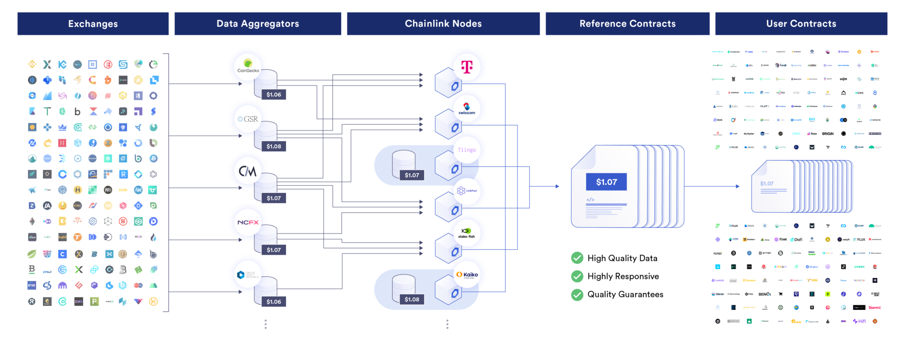

## A how-to guide for building a custom Chainlink oracle price feed that can be integrated into your Web3 application.



Smart contracts that opt out of Chainlink services such as price feeds resemble computers without internet access - highly restricted in capability.

Many Web3 developers are completely unaware that they can build and integrate any Chainlink price feed into their Web3 application that they need. Chainlink provides a diverse selection of [official data feeds](https://data.chain.link/feeds), encompassing various data types like asset prices, reserve balances, NFT floor prices, and more. While these feeds cover a broad spectrum, Web3 developers sometimes require data that goes beyond Chainlink's existing data feed offerings. To cater to these specialized needs, Chainlink allows for the creation of custom price feeds.

In this article we will:

1. Explain how decentralized Chainlink price feeds work.

1. Define high-level steps for creating a price feed for your Web3 application.

1. Offer a comparison between Chainlink **price feeds** and Chainlink **direct requests** (Any API).

1. Show you how to find a Chainlink oracle to support your price feed.

1. Explore use cases for Chainlink price feeds.

<!-- truncate -->

<center><iframe width="560" height="315" src="https://www.youtube.com/embed/e75kwGzvtnI" frameborder="0" allowfullscreen></iframe></center>

## **Chainlink's Decentralized Data Model**

In our previous article, we explored how Web3 developers can collaborate with Chainlink node operators to [create a custom data feed via Chainlink's basic request model](https://docs.linkwellnodes.io/blog/Requesting-A-Custom-Chainlink-Data-Feed-Using-Any-API) - also known as "direct requests" or "Any API". One of the primary benefits of this approach is that data is only written when requested by the consumer, saving on fees. This model uses a pull-based system to retrieve data on-chain from any internet source (Any API) at any desired frequency and is typically served by just a single Chainlink oracle.

This article will shift gears and instead delve into Chainlink's decentralized data model. We will explore how this model facilitates the establishment of custom decentralized oracle networks (DON) that compile data on-chain from multiple data sources through a decentralized network of independent node operators.

Ultimately, Chainlink price feeds allow data to be updated automatically within your smart contract based on a certain set of conditions, ensuring that your data is always fresh whenever your Web3 application needs it.

Chainlink's Decentralized Data Model aggregates data from multiple sources to ensure accuracy and reliability for smart contracts.

Offchain Reporting (OCR) and Flux Aggregator (FluxAgg) are two such protocols, with OCR optimizing for efficiency by processing data and reaching consensus off-chain, reducing costs and improving update speed. Flux Aggregator, its predecessor, performs a similar aggregation, but directly on the blockchain. **This article will focus on the Flux Aggregator protocol.**

The decentralized data model introduces a number of features:

1. **Security:** The DON aggregates data from multiple Chainlink oracles, reducing the risk of manipulation by any single oracle, and helping to eliminate single points of failure.

1. **Reliability:** The DON maintains high availability and reliability of data feeds, even if some data providers are compromised or incorrect.

1. **Accuracy:** Sophisticated algorithms filter out data anomalies, ensuring the data reflects true market conditions or measurable parameters accurately.

1. **Trust-Minimization:** All operations and data sources are transparent and verifiable, building trust among both users and developers.

1. **Customization:** Offers flexibility in specifying data sources, update frequencies, and aggregation methods to meet specific project requirements.

### **Components of the Decentralized Data Model**

<p align="center">
  
</p>

> In the architecture depicted above, three independent Chainlink oracle teams are showcased solely for illustrative purposes. In practice, any number and combination of independent Chainlink oracles can be employed. The flexibility in this arrangement is mainly motivated by considerations such as trust-minimization, reliability, and security budgets.
> Additionally, each Chainlink oracle can (and should) utilize a different external data source or API endpoint if at all possible. This provides decentralization at the external data source layer. For more on this topic, we recommend referring to Chainlink's article on [the 3 levels of aggregation for price feeds](https://blog.chain.link/levels-of-data-aggregation-in-chainlink-price-feeds/).

The components of the decentralized data model include:

**Consumer Contract:** A Consumer contract refers to any contract that utilizes Chainlink price feeds to access the data aggregated on-chain. To access this data, consumer contracts need to instantiate the appropriate [AggregatorV3Interface contract](https://github.com/smartcontractkit/chainlink/blob/master/contracts/src/v0.8/shared/interfaces/AggregatorV3Interface.sol) and execute one of its available functions.

```
    ...
    AggregatorV3Interface feed = AggregatorV3Interface(address);
    return feed.latestRoundData();
```

> Off-chain (Web 2.0) applications are also capable of utilizing price feeds. For further information, refer to the example code in JavaScript and Python on the [Using Data Feeds](https://docs.chain.link/data-feeds/price-feeds) page.

**Proxy Contract:** Proxy contracts serve as on-chain intermediaries that point to a specific aggregator associated with a data feed. This approach allows for the aggregator to be updated seamlessly, ensuring that contracts consuming the service experience no disruptions.

While the design of proxy contracts may differ across various data feeds, a frequently used example is the [AggregatorProxy.sol contract](https://github.com/smartcontractkit/chainlink/blob/master/contracts/src/v0.7/dev/AggregatorProxy.sol) available on Github.

```
    ...
    contract AggregatorProxy is AggregatorProxyInterface, ConfirmedOwner {
```

**FluxAggregator Contract:** This refers to the contract that periodically obtains data updates from the oracle network. It stores this aggregated data onchain, enabling consumers to retrieve the data and act upon it within the same transaction. This data can be accessed through the Data Feed address and by interfacing with the [AggregatorV3Interface contract](https://github.com/smartcontractkit/chainlink/blob/master/contracts/src/v0.6/interfaces/AggregatorV3Interface.sol).

```
      function latestRoundData()
        external
        view
        returns (
          uint80 roundId,
          int256 answer,
          uint256 startedAt,
          uint256 updatedAt,
          uint80 answeredInRound
        );
```

Typically, the client (the Web3 project or team in need of the price feed) is responsible for maintaining and deploying the FluxAggregator contract. However, Chainlink oracles (node operators) can assist with the deployment process. It is also up to the client to keep the contract funded with LINK tokens to guarantee payment for the Chainlink oracles' services.

For additional information on the AggregatorV3Interface API, please reference [Chainlink's documentation](https://docs.chain.link/data-feeds/api-reference#aggregatorv3interface).

**Chainlink Oracle:** The Chainlink node (or oracle) is an off-chain, Go-based runtime provided by Chainlink Labs. Oracles are typically operated by professional Chainlink node operator teams who specialize in deploying and maintaining Chainlink oracle infrastructure. They work in tandem with external adapters to collect data from various external sources, aggregate it to ensure accuracy and reliability, and then feed the requested data back to the on-chain aggregator contract.

Chainlink oracles run the Flux Monitor job specification, as demonstrated in the following example:

<p align="center">
  
</p>


This job specification outlines the criteria for data feed updates, including the sources of observation utilized and the frequency of updates on the blockchain. For more information on the Flux Monitor job spec, feel free to [review the fields here](https://docs.chain.link/chainlink-nodes/oracle-jobs/all-jobs#flux-monitor-jobs). These fields can be tuned as necessary as per the Web3 project's requirements
> Oracles that participate in the data aggregation process are compensated for their work, typically in the form of the Chainlink (LINK) token. This incentivizes oracles to provide accurate and timely data, ensuring the reliability of the data feed.

**External Adapters:** External adapters facilitate custom logic for requests as HTTP services that can be written in any programming language, handling tasks from authenticated data access to IoT processing and bank payments. They bridge various data sources, including enterprise systems and other blockchains, ensuring broad connectivity beyond simple HTTP requests.

Chainlink's list of external adapters can be found [here](https://github.com/smartcontractkit/external-adapters-js/tree/main/packages/sources).

**Data Sources:** Data sources refer to the external providers from which Chainlink oracles retrieve information. These can include financial market data, weather reports, sports outcomes, or any other real-world data that smart contracts may require.

### **Flux Aggregator Round System**

The Aggregator round system is a mechanism used by Chainlink to update data feeds in a decentralized and secure manner. Here's an overview of how it functions:

1. **Round Initiation:** A round represents a cycle in which data is aggregated and updated. Rounds can be initiated based on two main conditions: the Deviation Threshold and the Heartbeat Threshold.

* **Deviation Threshold:** This condition checks if the difference between the latest on-chain data and the new off-chain data collected by the oracles exceeds a pre-defined threshold. If the data deviates more than this threshold, it triggers a new round to update the on-chain data to reflect the more accurate, recent off-chain data.

* **Heartbeat Threshold:** This condition triggers a new round after a specified time has passed since the last update, regardless of data deviation. This ensures that the data feed is updated regularly, maintaining its relevance and accuracy over time.

2. **Data Collection:** Once a new round is initiated, participating oracles collect data from their off-chain sources. These sources can vary based on the data feed, ranging from financial market prices to real-world asset data.

3. **Data Aggregation:** After collecting the data, each oracle reports its findings back to the FluxAggregator contract. The contract then aggregates this data using a predefined method, such as taking the median or average, to determine the most accurate representation of the data collected from all participating oracles.

4. **Data Update:** The aggregated result is then updated on-chain, becoming the latest data point for the feed. This data then becomes available for smart contracts and other on-chain entities to use, ensuring they have access to accurate and timely information.

## Steps For Developing a Custom Price Feed With FluxAggregator

While we won't dive into the exact deployment process for the FluxAggregator protocol in this article (stay tuned for a future release on this), we will provide the high-level steps.

The steps for integrating a custom Chainlink price feed are:

1. **Locate a Chainlink node operator**: Join the **#operator-requests** channel of the [Chainlink Official Discord server](https://discord.com/invite/chainlink), or reach out to us (LinkWell Nodes) [here](https://linkwellnodes.io/).

1. **Explain your requirements**: Tell your chosen Chainlink oracle about your Web3 project's requirements for a price feed. These requirements can typically include the price feed pair, the number of node operators desired in the DON, and the data sources to be utilized. Once the requirements are clear, the node operator can assist you (if needed) in initially setting up the FluxAggregator contract on your selected testnet, configuring it, and supplying the price feed address to utilize the price feed in the consumer contract.

1. **Expand your oracle network**: Following comprehensive testing, you'll want to enlist additional Chainlink oracles in your price feed DON. Often, your chosen Chainlink oracle will have their own network of contacts they can reach out to for additional support.

1. **Deploy your price feed**: Deploy the FluxAggregator contract on mainnet alongside your Web3 application.

The bulk of the integration effort takes place on the Chainlink oracle's end, but from a consumer perspective, it's as simple as that!

## Price Feeds vs. Direct Requests (Any API)

While this article focuses primarily on price feeds, it may be helpful to offer a comparison with a different type of Chainlink request: [direct requests](https://docs.linkwellnodes.io/knowledgebase/Direct-Request-Guide) (also known as 'Any API').

**Price Feeds (i.e., Flux Aggregator)**:

**Pros**:

* Data is always up-to-date, as it is re-written on-chain whenever a certain % change in value occurs (i.e., whenever a 5% price deviation occurs).

* Can utilize multiple Chainlink oracles to serve your price feed, for enhanced decentralization and trust-minimization.

**Cons**:

* More expensive, as you pay for every on-chain update of your data.

* Longer and more complicated set-up, which potentially involves finding and communicating your requirements to multiple oracle teams.

**Direct Requests (Any API):**

<p align="center">
  
</p>

**Pros**:

* Cheaper, since you only pay for what you use (data is updated only when you request it, or on a set schedule).

* Quick and easy setup (you can be up and running within minutes using our [self-service documentation](https://docs.linkwellnodes.io/services/direct-request-jobs/Jobs-and-Pricing)).

* Can return any data type on-chain, whereas price feeds are limited to the *int* data type.

**Cons**:

* Takes at least 1 block for the data to appear on-chain, depending on the blockchain.

* Typically not as decentralized or trust-minimized as a price feed, although developers have the option to [utilize multiple Chainlink oracles in a DON](https://medium.com/linkwell-nodes/chainlinks-basic-direct-request-model-chainlink-oracle-architectures-explained-996e6e9d2bb4), if desired.

## **Where Can I Find a Chainlink Oracle?**

As of the time of writing, there lacks a centralized marketplace for Chainlink oracles (market.link has been deprecated). As such, the primary avenue for finding a Chainlink oracle / node operator is by sending a chat within the **#operator-requests** channel of the [Chainlink Official Discord server](https://discord.com/invite/chainlink). Additionally, a simple Google search can yield information about the various Chainlink node operators and the services they publicly offer.
> LinkWell Nodes is a U.S.-based Chainlink community oracle, providing custom data feed capabilities and self-service oracle solutions across virtually all major mainnet and testnet blockchains supported by Chainlink.
> Looking for a custom data feed? Head on over to our [documentation](https://docs.linkwellnodes.io/), or hop into the [LinkWell Nodes Discord server](https://discord.com/invite/Xs6SjqVPUA) and ask for help!

**What to Look For In a Chainlink Oracle (Node Operator)?**

Working with a knowledgeable and competent Chainlink node operator can greatly streamline the process, allowing you or your team to allocate resources more efficiently to your Web3 application. Furthermore, your Chainlink node operator should possess the expertise to assist in crafting your smart contract code, conducting code reviews, and suggesting gas optimization strategies within your smart contract. This will not only save you time, but can also preserve valuable funds in sending test requests to your Chainlink oracle.

Here's what you should look for when it comes to a Chainlink node operator:

1. Proven track record.

1. Trustworthy and reliable.

1. Strong communication skills.

1. Transparent and clearly-defined pricing.

1. Continuous monitoring of each data feed.

1. Reliable, secure, and redundant infrastructure.

1. Knowledgeable in Solidity and smart contract design.

1. A well-defined process for requesting custom price feeds.

1. A clear service-level agreement (SLA) for their price feed performance.

Ultimately, the responsibility is yours to diligently vet and select a Chainlink oracle (or oracles) who align with the characteristics above.

## Price Feed Example Use Cases

### **Money Markets**

Blockchain money markets are a key part of the decentralized finance (DeFi) ecosystem, using smart contracts to connect lenders looking to earn on their digital assets with borrowers seeking capital. These platforms increase the utility and liquidity of cryptocurrencies by enabling active lending and borrowing, thereby enhancing the liquidity and utility of digital assets across the board.

The operational efficiency and financial stability of these platforms hinge on the accurate and real-time valuation of assets, necessitating the integration of reliable price feeds. This is where sophisticated solutions like Chainlink price feeds come into play. They provide up-to-the-minute market data for a wide array of cryptocurrencies, thereby enabling protocols such as Aave and Compound to precisely assess the value of collateral and debt within their systems. This critical functionality allows these protocols to execute timely liquidations for undercollateralized positions, ensuring the financial integrity and solvency of the platform.

<p align="center">
  
</p>

In essence, blockchain-based money markets not only facilitate a dynamic environment for the DeFi community to lend and borrow assets efficiently but also underscore the importance of accurate price feeds in maintaining the economic stability and trustworthiness of these platforms. Through the strategic use of Chainlink price feeds, these protocols are able to uphold their commitment to safeguarding user assets while promoting healthy liquidity and fair market practices.

### **Asset Tokenization**

Tokenizing real-world assets, from currencies to stocks, bonds, real estate, and gold, opens up possibilities for increased investor access, improved transparency, and enhanced market liquidity.

For the successful tokenization of assets, the availability of accurate, onchain market price data via Chainlink price feeds is crucial. Take, for instance, the PAXG Chainlink price feed for tokenized gold, which allows for the creation of secure markets around physical gold. Moreover, Paxos leverages Chainlink Proof of Reserve to assure onchain that its tokenized gold offerings are fully backed by offchain gold reserves, fostering high-integrity markets for these assets.

<p align="center">
  
</p>

> For additional use cases of Chainlink price feeds, we highly recommend checking out Chainlink's article on the [77+ smart contract use cases enabled by Chainlink](https://blog.chain.link/smart-contract-use-cases/).

## **Conclusion**

Chainlink price feeds provide a way of ensuring your on-chain data is always fresh, by automatically updating your smart contract whenever a certain threshold criteria is met. They also provide a mechanism for further decentralizing your data feed, by allowing your data to be aggregated from multiple Chainlink oracles at a time.

In comparison to the [Direct Request](https://docs.linkwellnodes.io/knowledgebase/Direct-Request-Guide) (Any API) model, Chainlink price feeds are more expensive, as they are typically updated more frequently on-chain, and involve greater work and coordination to set up, although this may be worth it for some security-intensive and enterprise-grade applications.

The rigorous emphasis on blockchain data integrity and security has elevated Chainlink price feeds to the forefront as the most widely-adopted oracle solution within the DeFi sector. Moreover, Chainlink price feeds are tailored to expand in tandem with DeFi's evolution, supporting its ascent to become the underlying technology for major global financial markets, encompassing billions to trillions of dollars in value.

> LinkWell Nodes is a U.S.-based Chainlink community oracle, providing custom data feed capabilities and self-service oracle solutions across virtually all major mainnet and testnet blockchains supported by Chainlink.
> Looking for a custom data feed? Head on over to our [documentation](https://docs.linkwellnodes.io/), or hop into the [LinkWell Nodes Discord server](https://discord.com/invite/Xs6SjqVPUA) and ask for help!
> Disclaimer: all views and opinions expressed in this article are strictly our own.


