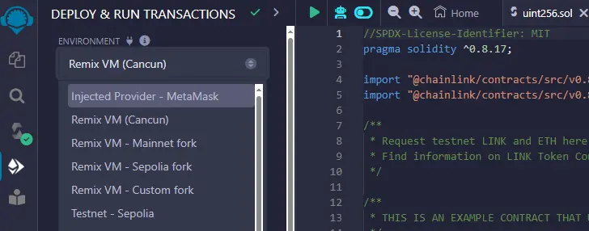
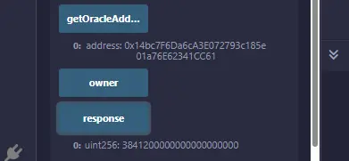

import TOCInline from '@theme/TOCInline';

<h2 class='lw-subtitle'>How to write, compile, and deploy a smart contract that uses Chainlink to retrieve data from the internet.</h2>

<center><small>Credit: [simplilearn.com](https://www.simplilearn.com/tutorials/blockchain-tutorial/what-is-smart-contract)</small></center>

<!--truncate-->

---

**On this page**:

<TOCInline
  toc={toc.filter((node) => node.level >= 1)}
  minHeadingLevel={2}
  maxHeadingLevel={2}
/>

---

## Introduction

In this guide, we'll show you how to build and deploy a smart contract that retrieves real-time price info (or any other data) using the Chainlink direct request model. For illustration purposes, we'll deploy our contract to the **Base Sepolia testnet** network, but any of our [supported networks](/services/direct-request-jobs/Jobs-and-Pricing) can be used with this tutorial. 

> *Without access to real-world data, many dApps simply wouldn't exist. Fortunately, [Chainlink](https://chain.link/) - the leading Web3 services platform - provides numerous options for retrieving data from the internet, off-chain compute, and even other blockchains.*

*Related video*: What is a smart contract?
<center><iframe width="560" height="315" src="https://www.youtube.com/embed/pWGLtjG-F5c" title="What is a smart contract?" frameborder="0" allow="accelerometer; autoplay; clipboard-write; encrypted-media; gyroscope; picture-in-picture; web-share" allowfullscreen></iframe></center>

## Prerequisites

Here are some things you'll need in order to follow this tutorial:

* **A Web3 Wallet**: Web3 wallets are required for not only storing your tokens, but also for deploying your smart contracts and signing blockchain transactions. Examples include [MetaMask](https://metamask.io/) and [Coinbase Wallet](https://www.coinbase.com/wallet).

* **An EVM-compatible IDE**: An Integrated Development Environments (IDE) that works with EVM-based blockchains is required for deploying and testing your smart contract. One such popular tool is [Remix](https://remix.ethereum.org/#lang=en&optimize=false&runs=200&evmVersion=null), but advanced users may prefer a development framework such as [Foundry](https://docs.chain.link/quickstarts/foundry-chainlink-toolkit), particularly for more complex projects.

* **A Chainlink oracle**: Chainlink oracles are cloud-based runtimes that connect smart contracts to the physical world. They are typically operated by reputable companies with a well-defined [SLA (Service-Level Agreement)](/services/direct-request-jobs/Service-Level-Agreement), and are highly secure, redundant, and resilient to attack. Chainlink oracles act as bridges, allowing blockchain applications to access off-chain compute, internet APIs (ie, weather, stock prices, and sports betting data, flight information, etc.), or even other blockchains.

:::tip
### Looking for a Chainlink oracle? 

LinkWell Nodes offers professional Chainlink oracle services on all major EVM-based mainnet and testnet blockchains. To view a directory of our oracle addresses and job IDs, please feel free to view our [Chainlink data feeds documentation](/services/direct-request-jobs/Jobs-and-Pricing).
:::

## **Step 1**: Set up and fund MetaMask

To deploy smart contracts on-chain, you'll first need a wallet and some of the respective chain's **native gas token** (the token used to pay for transactions on the blockchain). Since we'll be using Base network for this tutorial, we'll fund our wallet with `ETH`.

You can skip this section if you already have a Web3 wallet installed and have the appropriate gas token.

*Related video*: What is MetaMask?
<center><iframe width="560" height="315" src="https://www.youtube.com/embed/-HTubEJ61zU" title="What is MetaMask?" frameborder="0" allow="accelerometer; autoplay; clipboard-write; encrypted-media; gyroscope; picture-in-picture; web-share" allowfullscreen></iframe></center>


1. [Download and install MetaMask](https://support.metamask.io/getting-started/getting-started-with-metamask/#how-to-install-metamask) within your browser.

    

2. Add your required blockchain network to MetaMask:

    **2a.** Navigate to [Chainlist](https://Chainlist.org). 
    
    **2b.** Click **Connect your wallet**.
    
    **2c.** Search for your desired network, and click **Add to Metamask**.

    **2d.** In the resulting popup screen, hit **Approve**.
    
    *NOTE: You can also enter your network info manually within MetaMask if you have it handy, by going to **Settings** -> **Networks** -> **Add a network**:*

    

3. Fund your MetaMask wallet with gas tokens. If deploying to a testnet, you can acquire gas tokens for your desired network using the [Chainlink Faucet](https://faucets.chain.link/).

    

## **Step 2**: Write, compile, and deploy your Chainlink smart contract

In the following steps, you'll write, compile, and deploy a smart contract that fetches price data (a single `uint256` object) from the [CryptoCompare API](https://min-api.cryptocompare.com/) (free to use). The sample code below shows how to create a basic smart contract that makes on-demand requests to a Chainlink oracle for the price of **ETH** in USD.

:::info
Our Chainlink oracle jobs support all data types, from any API provider. Feel free to browse our [request documentation](/services/direct-request-jobs/Jobs-and-Pricing) for more information on how to cater your request to your exact data type.
:::

1. The first step is to copy the below contract into the **Remix IDE**. For ease of use, you can [open the contract directly in Remix](https://remix.ethereum.org/#activate=github&url=https://github.com/LinkWellNodes/Documentation/blob/main/docs/services/direct-request-jobs/testnets/Base-Sepolia/uint256/uint256.sol&lang=en&optimize=false&runs=200&evmVersion=null). 

    ```sol reference
    https://github.com/LinkWellNodes/Documentation/blob/main/docs/services/direct-request-jobs/testnets/Base-Sepolia/uint256/uint256.sol
    ```

    :::tip
    *Please pay special note to the constructor function, as its contents vary by Chainlink oracle, network, and data type.*
    
    *The above sample constructor is preconfigured to point to LinkWell Nodes's [Base Sepolia testnet uint256 oracle](https://docs.linkwellnodes.io/services/direct-request-jobs/testnets/Base-Sepolia-Testnet-Jobs?dataType=Uint256) - **you will need to edit it for your desired network and data type using our [request documentation](/services/direct-request-jobs/Jobs-and-Pricing)**.*
    :::

2. Use the default compiler settings for this contract. Click the **Compile uint256.sol** button to convert the Solidity code into bytecode that the [Ethereum Virtual Machine (EVM)](https://ethereum.org/en/developers/docs/evm/) can understand.

    

3. Now it's time to deploy the contract. Navigate to the **Deploy and run transactions** button on the left-hand sidepanel.

4. The next step is to configure the Remix environment to connect to your MetaMask wallet. You'll need to ensure that MetaMask is currently connected to the blockchain network of your choice.

    

    Under **Environment**, click **Injected Provider - MetaMask**. This will open up a MetaMask window that provides a few prompts to connect to Remix.

5. Next, you'll click the orange deploy button. This deploys the smart contract to the Base Sepolia testnet.

    

6. Deploying the contract opens a MetaMask prompt, which requests that you confirm the transaction. After a short period waiting period (typically a few blocks), your contract will be officially deployed to the blockchain!

    

**Your contract is now deployed!** 

Just like your MetaMask wallet, your new contract will have its own unique address on the blockchain. You can view the contract within your related blockchain explorer (ie, the [Base Sepolia block explorer](https://sepolia.basescan.org/)) by pasting your new contract address into the block explorer.

## **Step 3**: Execute your Chainlink oracle request 

Now let's request data from the Chainlink oracle!

1. In Remix, expand the contract that you just deployed (you'll see it under **Deployed/Unpinned Contracts**). You should see a number of different buttons that are highlighted in blue and orange - each of which represent a function within your smart contract. 
    
    * The **blue** buttons represent `view` or `pure` functions, which are read-only and do not modify the blockchain state. These functions do not require gas fees to execute. 
    
    * The **orange** buttons represent functions that modify the blockchain state, such as those that change variables or send transactions. These functions require gas fees to execute.

    

1. Click the `response` button, which should initially show `0`, since you haven't made an on-demand oracle request yet.

1. **Fund your contract**: If making your request on a **mainnet** blockchain, you'll need to send some LINK tokens to your deployed contract address. This allows a small payment in LINK to be sent with each oracle request, in order to compensate the Chainlink oracle for the gas required to write your response on-chain. The amount of this payment is governed by the `setFeeInHundredthsOfLink(0);` line in your constructor function, but must match the amount specified by your Chainlink oracle, or the request will fail.

    :::info
    You can skip this step on testnets, as our request fee is set to 0 LINK.
    :::
    
    :::tip
    At LinkWell Nodes, we allow for alternate payment currencies, and discounts for up-front payments, offering you the option to pay for your requests in ETH, USDC, or even fiat.
    :::

1. **Make the oracle request**: Click the orange `request` button. This initiates an on-demand request to the specified Chainlink oracle, and will open up another MetaMask prompt that will require you to confirm the blockchain 'oracle request' transaction. Click 'Approve' in MetaMask to submit the transaction, and send the required payment (if any) to your oracle.

    

1. Within **3-5 blocks** (depending on your chosen blockchain), the Chainlink oracle will update the `response` variable in your contract with the latest price of Ethereum, denominated in USD. Click the `response` button again to view your result.

    

    :::info
    Take note that the CryptoCompare URL specified in the request function provides a JSON response of the ETH value with decimals (ie **3833.23**.).  Due to the fact that decimals do not work in Solidity, the **3833.23** value is multiplied by a large amount (governed by the `req._addInt('multiplier', 10 ** 18);` line in your contract), in order to remove the decimals before writing the value on chain.
    :::

    :::tip
    **Having trouble with your request?** Check our [Chainlink Direct Requests FAQ](/knowledgebase/faq/Chainlink-Users#chainlink-direct-requests), or reach out to us in [Discord](https://discord.gg/Xs6SjqVPUA) if you require assistance with this request.

Now that the latest Ethereum price is stored in a variable in your contract, you can execute additional logic based on this updated value, such as:

* **Executing trades**: Automatically buy or sell assets based on predefined price conditions.
* **Issuing stablecoins**: Adjust the supply of a stablecoin to maintain its peg relative to Ethereum's price.
* **Updating DeFi protocols**: Adjust interest rates or collateral requirements in decentralized finance applications.
* **Triggering payments**: Send payments or rewards when Ethereum reaches certain price milestones.
* **Minting NFTs**: Automatically mint or update NFTs based on the data received from your Chainlink request.

> _Making an on-demand request to a Chainink oracle is one of several options that we support for updating variables within your smart contract. We also offer automatic updates at **set frequencies**, **% deviations in value**, or other trigger conditions. If interested in learning more about our various Chainlink services, head on over to our [documentation](/) to find out more._

Interested in diving deeper into the process of making a direct (on-demand) Chainlink oracle request? Please refer to our [developer documentation](https://docs.linkwellnodes.io/blog/Chainlink-Direct-Requests-Guide) for details.


## Conclusion

Deploying your Chainlink-connected smart contract on any network is easy, and is a powerful way to integrate real-world information into your decentralized application. By following this tutorial, you've learned how to set up a Web3 wallet along with your development environment, write and compile a smart contract, and make a direct request to LinkWell Nodes's oracle services. 

We hope that this tutorial has provided you with a strong foundation for creating dynamic and responsive Web3 applications, ultimately enabling you to harness the full potential of blockchain technology.

> _LinkWell Nodes is a U.S.-based Chainlink community oracle, providing custom data feed capabilities and self-service oracle solutions across virtually all major mainnet and testnet blockchains supported by Chainlink._
>
> _Looking for a custom data feed? Head on over to our [documentation](/), or hop into the [LinkWell Nodes Discord server](https://discord.com/invite/Xs6SjqVPUA) and ask for help!_
>
> _Disclaimer: all views and opinions expressed in this article are strictly our own._

