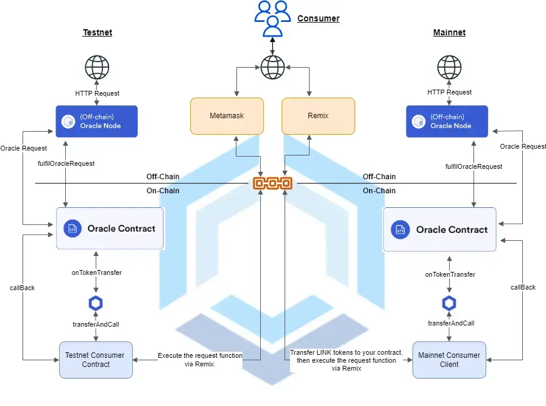
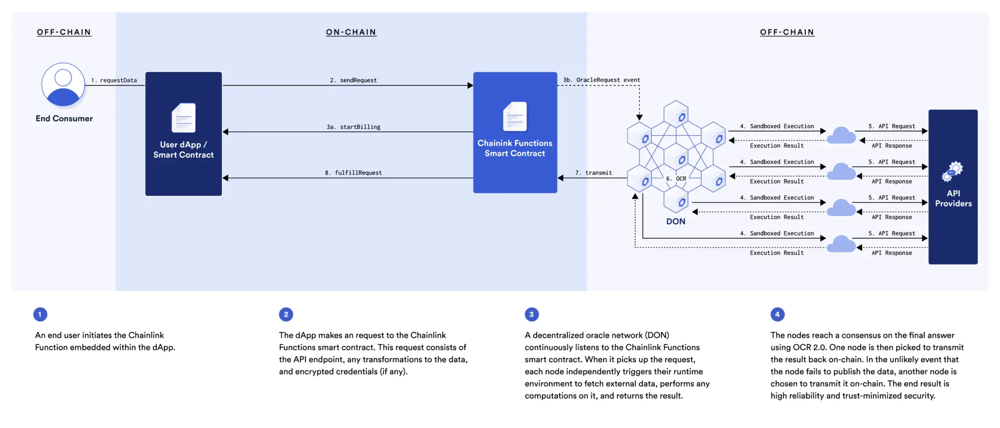

<!--truncate-->

**Direct Requests vs. Functions: How to decide?**

Navigating the ever-evolving landscape of Chainlink and its integrations within the Web3 ecosystem can at times be daunting.

Since its inception, Chainlink has evolved at a rapid rate. One of the original services provided by Chainlink's decentralized oracle network was [Direct Request jobs](https://docs.chain.link/any-api/introduction) (also known as "Any API") — Chainlink's first iteration of a solution to help bridge the gap between on-chain and off-chain data. While it worked effectively, there were inherent shortcomings that eventually prompted the release of [Chainlink Functions](https://docs.chain.link/chainlink-functions), marking an improvement in security, reliability, and self-service capabilities.

Yet, after the release of Functions, a lingering question remains:

**Are Direct Requests still viable?**

We would argue that they are. 

Make no mistake: Chainlink Functions is a monumental enhancement for off-chain computation and data retrieval, and we believe that Web3 teams should consider using Functions if and when applicable.

> *Disclaimer: All views below are strictly our own, and not the views or opinions of Chainlink Labs. As a community-based Chainlink node operations team with extensive [Chainlink Direct Request service offerings](https://docs.linkwellnodes.io/services/direct-request-jobs/Jobs-and-Pricing), we acknowledge our potential bias in writing on this topic. In that vein, we promise to be as objective as possible in assessing the relevance of both approaches.*

While Chainlink Functions reigns supreme in many ways to the traditional Direct Request model, there are pros and cons to each approach. Having a nuanced understanding acknowledges the fact that Direct Requests can still be a relevant option for off-chain data data retrieval and computation, depending on your use case.

Our objective here is to illuminate this choice for Web3 developers, who might be faced with the challenge of selecting one over the other.

**Let's begin by examining Chainlink Direct Requests (Any API):**

<iframe width="100%" height="315" src="https://www.youtube.com/embed/ay4rXZhAefs?si=Rat05_PI4LfNU1dJ" title="Requesting data from a Chainlink oracle using Any API (Direct) Requests" frameborder="0" allow="accelerometer; autoplay; clipboard-write; encrypted-media; gyroscope; picture-in-picture; web-share" allowfullscreen></iframe>

Direct Requests are the first iteration of Chainlink's service offerings that allow Web3 teams to write off-chain data (ie, data from the internet) to the blockchain. With their initial release, Direct Requests enabled a wide array of use cases across many industries ranging from finance, to insurance, to NFTs, and more.

More specifically, Direct Requests allow for a smart contract developer to make ad-hoc requests to an existing Chainlink node (oracle), which in turn responds by writing the requested value(s) back to the requestor's smart contract. In short, Direct Requests allow smart contracts to request data from the internet in a secure way.

While our [documentation](https://docs.linkwellnodes.io/knowledgebase/Direct-Request-Guide) elaborates much more extensively on the mechanics of Direct Request jobs, here's a high-level overview:

1. A smart contract (i.e., ChainlinkClient) — also known as a 'consumer contract' — makes a request to an on-chain oracle contract, typically owned and operated by a Chainlink node operator.
2. The relevant Chainlink node receives the request, interacts with the relevant API endpoint via HTTP, and writes the requested data back to the consumer contract.
3. The Web3 application reads the data from the consumer contract and executes the desired business logic based on this data.

The following diagram illustrates a direct request to a Chainlink node via the manual triggering of the smart contract's request function. This request may be triggered via MetaMask, Chainlink Automation, web3.js call to an RPC endpoint, or any other means.

**Figure 1**: Chainlink Direct Request Model

Until recently, Direct Requests were the only viable solution for Web3 developers looking to securely write external data on-chain. Since its inception, Direct Requests have successfully been implemented by hundreds of teams within the [Chainlink Ecosystem](https://www.chainlinkecosystem.com/ecosystem).

And yet — inherent shortcomings within the Direct Request model have precipitated the emergence of Chainlink Functions.

**Shortcomings of the Direct Request model:**

1. **Searching for a Suitable Chainlink Node Operator**- To make a direct request, Web3 developers must first find a suitable node operator via [Chainlink's official Discord server](https://discord.com/invite/chainlink) (#operator-requests channel).
2. **Reliability Concerns** — Within distributed and decentralized systems, single points of failure (SPOFs) are not ideal. Selecting a single Chainlink node operator — especially one not well-versed in an elastic, redundant infrastructure design- can lead to availability and reliability concerns.
3. **Centralization Risks** — Entrusting data to a single Chainlink node operator poses trust issues, wherein a nefarious node operator could potentially manipulate data before writing it on-chain.
4. **External Adapters** — Direct Requests must offload any advanced logic (ie, complicated parsing or post-processing of data) to an external adapter (EA) — a small, server-side runtime that hosts such functionality. Some oracles (such as us!) offer this service for free, whereas others require you to write or provide your own external adapter.

As a result of these drawbacks, some Web3 developers have resorted to running their own Chainlink node in order to mitigate security and trust concerns. Yet, running a production-grade Chainlink infrastructure demands [substantial effort](https://docs.linkwellnodes.io/knowledgebase/faq/Chainlink-Operators#profitability), diverting valuable resources (both financial and otherwise) that could otherwise be spent on application development.

> *&nbsp;**A short plug**: At LinkWell Nodes, we offer a robust suite of Direct Request service offerings that mitigates many of the above shortcomings. By following our [Direct Request API documentation](https://docs.linkwellnodes.io/services/direct-request-jobs/Jobs-and-Pricing), you'll be able to develop a self-service Any API solution, and be up and running in minutes.*
> 
> *We also offer a comprehensive list of free service offerings to all customers, including free external adapter development, hosting, [data security guarantee](https://docs.linkwellnodes.io/services/direct-request-jobs/Service-Level-Agreement), and 24/7 monitoring of your direct request infrastructure.*

---

**Enter Chainlink Functions.**

As a result of the historic challenges with Direct Requests, [Chainlink Functions](https://docs.chain.link/chainlink-functions) emerged as a decentralized, self-service alternative in March 2023. Chainlink Functions executes all request logic on a DON (Decentralized Oracle Network), instead of via a single Chainlink Oracle — thereby minimizing concerns around centralization and reliability.

It's worth mentioning that Chainlink Functions operates via a self-service request model: users write their request functionality in JavaScript (JS), and a network of node operators executes the logic and returns the response.

**Figure 2**: Chainlink Functions request model

From [Chainlink's blog](https://blog.chain.link/introducing-chainlink-functions/), major benefits of Functions include:

* **Trust-minimized security:** Build upon time-tested decentralized infrastructure that already helps secure billions of dollars for Web3 apps.
* **Self-service model:** Get started in minutes with Functions' serverless development solution, which features a CLI, starter kits, and a debugging environment.
* **Serverless runtime environment:** Run JavaScript (JS) code in a serverless manner so that you can focus less on infrastructure (ie, writing an external adapter), and more on your core application.

The accessibility brought by Functions fundamentally transforms the landscape for Web3 developers, opening boundless opportunities for smart contracts to interact with the real world in a trust-minimized manner.

**Drawbacks of Chainlink Functions:**

Despite the obvious benefits and allure of Chainlink Functions, certain [limitations](https://docs.linkwellnodes.io/knowledgebase/faq/Chainlink-Users#limitations-of-chainlink-functions) do need consideration:

1. **Limited Beta:** Functions is currently in limited Beta. Chainlink's documentation currently states that "developers must follow best practices and not use the Beta for any mission-critical application or secure any value". Furthermore, Functions is only live on four mainnets at the time of this writing — Ethereum, Polygon, Arbitrum, and Avalanche (you can check the most up-to-date list of networks here).
2. **Service Limits:** Functions imposes several service limitations (ie, gas cost, execution time, and idempotence of your business logic) which you can view within [Chainlink's documentation](https://docs.chain.link/chainlink-functions/resources/service-limits).
3. **Must program your own request in JavaScript (JS):** Lastly, in order to use Chainlink Functions, you'll need to write your own request and response logic using JavaScript (JS). This may be a limitation for some users.

While Chainlink Functions will almost certainly continue to evolve, the current state of the above limitations may give some users pause for production Web3 applications.

In the mean time, if you are a Web3 developer or project with time-sensitive requirements for off-chain data and/or computation for your mainnet applications, but are concerned about the above limitations, you ultimately have three options: 1) Wait for Functions to evolve and mature more to support your use case, 2) Implement Functions as-is, or 3) Utilize the Direct Request model (ie, reach out to an existing node operator, such as [ourselves](https://docs.linkwellnodes.io/services/direct-request-jobs/Jobs-and-Pricing)).

**Pros of Chainlink Direct Requests:**

Given some of the above limitations of Functions, the advantages of Chainlink's Direct Request model for some use cases becomes a bit more clear:

1. **Maturity:** Direct Requests have a longer-standing track record and established familiarity among developers. This maturity may simplify integration for some users — especially ones with projects that have already implemented the Direct Request logic within their systems.
2. **Control and Customization:** While Functions provides streamlined and efficient execution, it may not accommodate the specific needs of certain applications which may exceed Function's service limitations (ie, gas costs, network support, execution time, etc.).
3. **Mainnet Support:** Direct Requests are supported across all mainnet chains that [Chainlink supports](https://docs.chain.link/resources/link-token-contracts).
4. **Pricing:** There is also typically a good deal of wiggle room in how much LINK is charged for each Direct Request job, whereas Functions uses a fixed calculation. Additionally, experienced Chainlink node operators can even help out with gas optimization within the client/consumer contracts request and fulfill functions, ultimately enabling them to reduce the amount of LINK charged per request.
5. **Human Support:** While power users may not require it, establishing a relationship with an existing node operator via the Direct Request model provides for an experienced human component, and a support team that's available when you need the help.

---

**Conclusion**

The debate between Chainlink's Direct Requests and the innovative Chainlink Functions capabilities reflects the dynamic evolution within Web3, and more specifically, Chainlink's journey to becoming the industry-standard Web3 oracle platform.

While Chainlink Functions introduces a new realm of efficiency and security within the Chainlink ecosystem for Web3 developers, there are several limitations that warrant consideration. Conversely, while Direct Requests may offer benefits in terms of hands-free implementation, available networks, and pricing, one must consider centralization and reliability risks when making their decision. It's clear that each approach offers distinct advantages and limitations — choosing one will require careful consideration based on the specific needs of your project.

As the Web3 ecosystem continues to evolve, a nuanced understanding of these approaches will help to empower Web3 developers to navigate the complexities of off-chain data retrieval and computation, and implement the best solution for their endeavors.

If you have any questions, please don't hesitate to reach out!

> *LinkWell Nodes is a U.S.-based Chainlink oracle.*
>
> *We provide custom data feed capabilities and self-service oracle solutions across all major mainnet and testnet blockchains supported by Chainlink.*
>
> *Looking for a custom data feed? Head on over to our [documentation](https://docs.linkwellnodes.io/services/direct-request-jobs/Jobs-and-Pricing)*, *or hop into our [Discord server](https://discord.com/invite/Xs6SjqVPUA) and ask for help!*

