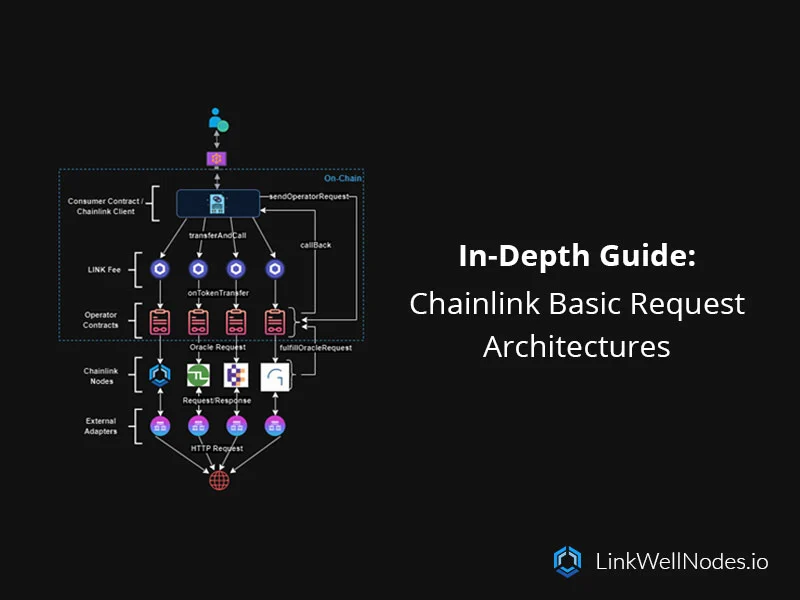

import TOCInline from '@theme/TOCInline';

<h2 class='lw-subtitle'>An in-depth guide into Chainlink's Basic Request (Direct Request) model, and its various deployment architectures</h2>

<!--truncate-->

---

**On this page**:

<TOCInline
  toc={toc.filter((node) => node.level >= 1)}
  minHeadingLevel={2}
  maxHeadingLevel={3}
/>

---

## Introduction

Chainlink's basic request model - previously known as the "direct request model" - is a bit of a misnomer.

While this model can indeed be viewed as the "basic" building block of Chainlink oracle requests - especially in comparison to some of its more recent counterparts such as Functions, Off-Chain Reporting (OCR), and the Cross-Chain Interoperability Protocol (CCIP) - the Basic Request Model supports a number of different deployment architectures that allow it to connect your smart contract to virtually anywhere on the internet.

In this article, we'll unravel the intricacies of Chainlink's basic request model, shedding light on the various architectures / design patterns that Web3 developers can implement to incorporate reliable, real-world data into their decentralized applications.

:::tip
### Looking for a Chainlink oracle, oracle address, or job id?
View our [Chainlink data feeds documentation](/services/direct-request-jobs/Jobs-and-Pricing), which has everything you need to get started requesting data from our reliable, distributed oracle infrastructure.
:::

## What is Chainlink's Basic Request (Direct Request) Model?

This article will provide an in-depth analysis of the components that make up the basic request model. Subsequently, we will delve into the architectures that developers have at their disposal for their Web3 applications.

> For a high-level overview of the basic request model (direct request model), you can also visit our [website's documentation](/blog/Chainlink-Direct-Requests-Guide), our previous article on [building custom Chainlink data feeds using Any API](/blog/Requesting-A-Custom-Chainlink-Data-Feed-Using-Any-API), or our exploration of [Chainlink Functions Versus Direct Request Jobs](/blog/Chainlink-Any-API-Direct-Requests-Vs-Functions).

  

The components of the basic request model implementation include the following:

* **Consumer Contract / [ChainlinkClient.sol](https://github.com/smartcontractkit/chainlink/blob/master/contracts/src/v0.8/ChainlinkClient.sol):** The consumer contract (or "client") is a contract that enables smart contracts to consume data from Chainlink oracles. It's available in the Chainlink smart contract library, which can be [installed using one of several package managers](https://docs.chain.link/resources/create-a-chainlinked-project). The client initiates a request to a known Chainlink oracle by utilizing the **transferAndCall()** function. Your request data is encoded and passed to this function call. The initiation of this call, specifically within the **ChainlinkClient** contract, is executed through the **sendChainlinkRequest() **or** sendChainlinkRequestTo()** function.

* **Chainlink (LINK) Token:** LINK is a token that adheres to the ERC-677 standard, incorporating the **transferAndCall()** function. This function enables the simultaneous transfer of tokens and the initiation of specific logic within the receiving contract, all within a single transaction. The sent LINK token is used to pay the corresponding node operator for fulfilling your request. More information on the LINK token and LINK token contracts can be found [here](https://docs.chain.link/resources/link-token-contracts).

* **Oracle/Operator Contract:** The oracle (or operator) contract is a contract deployed by any team operating a Chainlink node (oracle), and operates in tandem with the corresponding Chainlink node(s). Oracle contracts manage on-chain **requests** initiated through the LINK token by using the **onTokenTransfer()** function as a **LinkTokenReceiver**. When this function is executed, the oracle contract emits an **OracleRequest** event, conveying essential information about the request to the Chainlink oracle. This event serves as a for the off-chain oracle node to take the necessary actions in fulfilling the client's request. To **fulfill** requests, the oracle contract contains the **fulfillOracleRequest()** function, which is called by the oracle node once the requested result (data) is ready to be written to the blockchain. This function sends the result back to the **ChainlinkClient** contract, by executing the callback (fulfillment) function provided by the client within the initial request.

* **Chainlink Node (oracle):** The Chainlink node (or oracle) is an off-chain, Go-based runtime provided by Chainlink Labs that actively monitors events emitted by its associated on-chain **oracle contract**. Upon detecting an **OracleRequest** event, the node utilizes the emitted data to execute a specific request workflow (or "job"). One of the most common job types for a node involves making a GET request to an API, parsing the response, converting the result into blockchain-compatible format, and finally submitting it back to the oracle contract through an on-chain transaction, utilizing the **fulfillOracleRequest()** function.

* **External Adapters:** External adapters exist to execute any custom logic required for the request. External adapters are essentially HTTP services (programmed in any language), and thus they can execute whatever custom logic necessary for the request. Common workflows handled by external adapters include passing authenticated requests to premium data providers, processing IoT sensor information, handling bank payments, communicating with enterprise back-ends, other blockchain networks, and connecting to various other data sources that might not be accessible via a simple HTTP request.

* **API (i.e., the internet):** An API endpoint is the specific URL or data service (i.e., CoinMarketCap) to which the offchain oracle (or external adapter) makes its request for data. In the context of Chainlink, an API is the source of the data that you'd like written to your smart contract.

## Basic Request Model Oracle Architectures

The following architectures depict the sequential progression of a Web3 developer manually triggering the request function within their consumer contract. It commences with the most straightforward oracle architecture - a direct request to a single Chainlink oracle owned and operated by a single Chainlink node operator, and advances to the most advanced architecture - a direct request to multiple Chainlink oracles owned and operated by multiple independent Chainlink node operators.
> To simplify the forthcoming architectural diagrams, we have opted to exclude the potential integration of other Chainlink services, including VRF, Automation, CCIP, official Chainlink data feeds, and others. Nevertheless, we advise incorporating Chainlink Automation, at the very least, to streamline the request pipeline based on specific external triggers.
> **Moreover, depending on the requirements of your Web3 project, we strongly suggest integrating any and all Chainlink services necessary for the project's success!**

### **Architecture 1**: Direct Request to a Single Chainlink Oracle

  

**Architecture 1** is the simplest version of the basic request model. The sequence begins with a Web3 developer triggering a request (through the on-chain consumer contract) to a single Chainlink oracle owned by a single Chainlink node operator. The Chainlink oracle fetches the requested data and submits the obtained result back on-chain.
> **Important note**: Reputable node operators will run multiple Chainlink nodes in a redundant cluster, having one "primary" oracle responding to requests, and at least one "backup" oracle operating in passive mode, ready to take over in case of a failure in the primary oracle.
> At LinkWell Nodes, we operate all of our [mainnet oracles](/services/direct-request-jobs/mainnets) in redundant, fault-tolerant, location-independent clusters, ensuring that your workload will complete on time, every time.

**Pros:**

* Simplified configuration and deployment (can be up & running within the day).

* Most cost-effective choice.

**Cons:**

* Centralization at the oracle team layer (requires you to find an oracle team that you trust).

**When to Implement?**

* Your Web3 project operates on a constrained budget, limiting support for requests to multiple Chainlink oracles.

* You would benefit from an oracle team designing and implementing the request for you.

* Chainlink Functions doesn't support your use case or network.

### **Architecture 2**: Direct Request to Multiple Chainlink Oracles

  

**Architecture 2** closely resembles **Architecture 1**, with the primary difference lying in the inclusion of multiple Chainlink oracles (linked to separate oracle/operator contracts) handling the request. These oracles are owned and overseen by the same Chainlink node operator.
> With this architecture, each Chainlink oracle can (and should) utilize a different external data source or API endpoint if possible. This provides decentralization and enhanced reliability at the external data source layer. For more on this topic, we recommend referring to Chainlink's article on [the 3 levels of aggregation for price feeds](https://blog.chain.link/levels-of-data-aggregation-in-chainlink-price-feeds/).

**Pros:**

* Enhanced decentralization at the Chainlink oracle layer.

* Increased reliability of the request pipeline.

* Decentralization at the external data source layer.

**Cons:**

* Increased intricacy in configuration and deployment.

* Centralization at the oracle team layer (requires trust in the oracle team that you have chosen).

* The per-request cost scales by N(x), where "N" is the number of independent Chainlink oracles fulfilling the request.

**When to Implement?**

* For mainnet use cases, this architecture presents itself as a strong candidate, particularly when explicit trust is vested in the selected Chainlink node operator.

* You would benefit from oracle teams designing and implementing the request for you.

* Chainlink Functions doesn't support your use case or network.

### **Architecture 3**: Direct Request to a Multiple Chainlink Oracles Across Independent Chainlink Node Operators

  

**Architecture 3** is distinct from **Architecture 2** in that it incorporates multiple independent Chainlink oracle teams. Diverging from previous designs, this architecture embraces the essence of decentralization, emulating a decentralized oracle network (DON) as seen with Chainlink's official protocols.

> In the architecture depicted above, four independent Chainlink oracle teams are showcased solely for illustrative purposes. In practice, any number and combination of independent Chainlink oracles can be employed. The flexibility in this arrangement is mainly motivated by considerations such as trust-minimization, decentralization, and cost factors.

**Pros:**

* Maximal trust-minimization across all layers.

* Decentralization across all layers.

* Maximal reliability of the request pipeline.

**Cons:**

* Requires you to find and reach out to multiple oracle teams, and convince them to implement a decentralized oracle network for your request. The fees and time commitment of such designs can be high.

* Increased intricacy in configuration and deployment.

* The per-request cost scales by N(x), where "N" is the number of independent Chainlink oracles fulfilling the request.

**When to Implement?**

* When maximum decentralization, reliability, and trust-minimization are a priority for your Web3 application.

* Chainlink Functions doesn't support your use case or network.

### **Bonus Architecture**: Direct Request Without a LINK Fee

  

As a notable feature of the basic request model, we are introducing a bonus architecture where Chainlink node operators have the option to eliminate the LINK fee for each request and opt for alternative forms of payment, such as fiat or other L1/L2 tokens. **This methodology can be implemented within any of the above architectures in this article.**

Additionally, this opens the door to innovative payment models as demonstrated by the following:

* Bulk up-front payments for a set number of requests to the Chainlink oracle.

* Discounts for high volume use cases.

* Monthly flat fees for unlimited/exclusive use of the Chainlink oracle, where on-chain oracle data submission costs are reimbursed to the node operator by the consumer.

### Key Takeaways

We'd like to leave four final takeaways for your consideration when deciding which architecture to implement using Chainlink's basic request model:

* **Trust-Minimization and Decentralization:** When choosing your architecture, it's necessary to put some thought into what aspects of your design require decentralization - datacenter decentralization, oracle team decentralization, and data source decentralization, are all key components that one must consider.

* **On-Chain Reporting Speeds:** A fundamental advantage of the basic request model for Web3 use cases - particularly those reliant on swift on-chain reporting speeds - lies in the ability of direct request jobs to provide oracle request results on-chain within 1–3 blocks of the initial request.

* **Data Aggregation with the Basic Request Model:** In all architectures, Web3 developers possess the flexibility to aggregate the data received by their request, whether through the usage of an external adapter, or an aggregator contract.

* **Functions:** While Chainlink's basic request model has successfully served hundreds if not thousands of Web3 projects since Chainlink's launch, [Chainlink Functions](https://docs.chain.link/chainlink-functions) represents a viable alternative. While Functions is still in mainnet BETA and may not be recommended for production workloads, Web3 developers may want to review Functions before opting for the basic request model.

## Conclusion

Chainlink's basic request model (also called "direct requests") represents a capable and flexible method of retrieving off-chain (i.e., internet) data and writing it to your contract.

Within the basic request model, several different architectures and design patterns exist, all of which juggle trade-offs in terms of centralization, cost, and complexity. While other Chainlink services may offer a different presentation of the above trade-offs, the basic request model continues to be one of the fundamental building blocks that make Chainlink so versatile at solving the blockchain oracle problem.

We trust that this article sheds helps to shed some light on the various Chainlink oracle architectures available within the basic request model, and offers valuable insights to Web3 developers looking to integrate real-world data into their blockchain smart contracts.

> **Why Chainlink?**
>
> Smart contracts are limited from directly interacting with the internet, creating what's known as the blockchain [oracle problem](https://chain.link/education-hub/oracle-problem). This hurdle represents one of the greatest limitations in building Web3 smart contracts.
> Hybrid smart contracts solve this by using oracles as middleware - enabling external data publishing & retrieval, and scalable off-chain computations. Oracles act as a two-way bridge, enhancing connectivity while providing security against single points of failure.
> Chainlink - the industry standard Web3 oracle platform - is the most widely used decentralized oracle network, securing over $75B in value across a diverse assortment of blockchains. It operates as an ecosystem of independent decentralized oracle networks (DONs), guaranteeing robust and versatile oracle services.

---

> _LinkWell Nodes is a U.S.-based Chainlink community oracle, providing custom data feed capabilities and self-service oracle solutions across virtually all major mainnet and testnet blockchains supported by Chainlink._
>
> _Looking for a custom data feed? Head on over to our [documentation](/), or hop into the [LinkWell Nodes Discord server](https://discord.com/invite/Xs6SjqVPUA) and ask for help!_
>
> _Disclaimer: all views and opinions expressed in this article are strictly our own._

