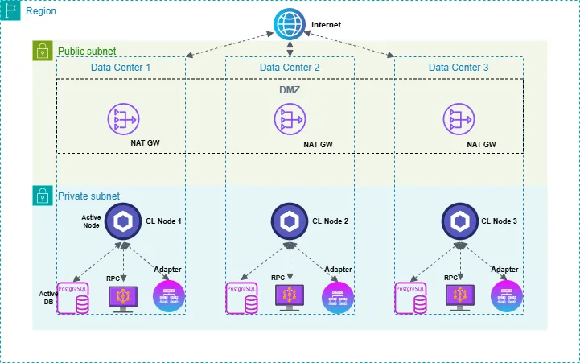

---

title: "Chainlink Node Operations: Security and Monitoring Best Practices and Insights"
description: "An in-depth guide to securing Chainlink node infrastructure against cyber threats and achieving full operational visibility"
date: "2024-12-19"
image: ./Chainlink-Architecture-Final.webp
keywords: [chainlink oracle, chainlink node operator, splunk, web3, cybersecurity]
authors: [Ken]
tags: [chainlink node operator, cybersecurity, splunk]

---

import TOCInline from '@theme/TOCInline';

<h2 class='lw-subtitle'>An in-depth guide to securing Chainlink node infrastructure against cyber threats and achieving full operational visibility</h2>

<p align="center">
  
</p>

<!--truncate-->

---

**On this page**:

<TOCInline
  toc={toc.filter((node) => node.level >= 1)}
  minHeadingLevel={2}
  maxHeadingLevel={2}
/>

---

## Introduction

In today's digital landscape, security breaches and exploits have become disturbingly common, impacting both Web2 and Web3 ecosystems alike.

**With over a decade of experience securing and monitoring enterprise systems and networks, we've learned that the question isn't *if* you'll be targeted, but *when*.**

This reality makes it crucial for Web3 infrastructure providers and node operators to implement robust security and monitoring measures, adopting defense-in-depth strategies that encompass both Web3 and Web2 domains. This article explores best practices and actionable insights for securing and monitoring not only your Chainlink oracle infrastructure but also the Web2 systems and platforms that support them.

## The importance of securing your Chainlink oracle Infrastructure

Adversaries are constantly evolving and remain highly motivated to steal, compromise, exploit, or destroy digital assets and infrastructure.

Thanks to forward-thinking organizations like [Chainlink Labs](https://chainlinklabs.com/), the conversation around blockchain, oracle, and smart contract security has advanced significantly within the Web3 ecosystem. **However, it is also critical to address the security of the underlying Web2 infrastructure that supports these Web3 protocol networks.** Chainlink node operator infrastructure shares operational parallels with traditional Web2 systems. This infrastructure encompasses several types of nodes, or instances, running on virtual or physical servers connected to the internet, and require robust security measures. 

Beyond nodes, other elements integral to Web3 operations - such as private keys, email accounts, social media platforms, cloud services, and user devices - remain high-value targets for malicious actors. 

To mitigate these risks, Web3 organizations should adopt a holistic defense-in-depth strategy that extends beyond the blockchain and encompasses their entire operational ecosystem. 

As the [backbone of the Chainlink network](https://docs.linkwellnodes.io/blog/Chainlink-Node-Operator) node operators share a critical role in upholding this standard. While Chainlink's multi-layered security framework (decentralization, aggregation, staking, monitoring, etc.), makes breaching decentralized oracle networks extremely challenging, individual Chainlink node operators remain potential targets for attacks. 

A successful compromise of a Chainlink node operator could lead to significant consequences, including (but not limited to):

**Operational disruption:**

- *Data Integrity Issues:* Attackers could manipulate the data provided by the node, resulting in incorrect information being written on-chain.
- *Service Downtime:* The compromised node may become unresponsive, leading to delays or failures in fulfilling data requests.

**Financial losses:**

- *Resource Drain:* As seen in [past incidents](https://www.theblock.co/post/76986/chainlink-nodes-attack-eth), attackers can exploit Chainlink nodes to deplete their resources, such as ETH balances, hindering their ability to operate effectively.
- *Penalties and Fines:* Depending on the network's governance, compromised nodes might face penalties for failing to meet service agreements.

**Reputational damage:**

- *Loss of Trust:* Clients and users may lose confidence in the node operator's ability to provide secure and reliable services.
- *Business Impact:* A tarnished reputation can lead to a loss of existing clients and deter potential future partnerships.

## Basic architecture of a Chainlink Oracle

Chainlink node operators are responsible for managing a wide range of resources, including (at a minimum): Chainlink nodes, load balancers, RPC nodes, external adapters, databases, and monitoring systems. To ensure reliability and resilience, these systems are often configured for high availability and disaster recovery, with deployments typically distributed across multiple geographically-distinct data centers. 

The diagram below illustrates a simplified Chainlink oracle architecture:

<center><small>Simplified Chainlink oracle architecture diagram</small></center>

In reality, a production Chainlink node operator's architecture may be significantly more complicated (involving bastion hosts, monitoring hosts, cross-region VPC links, etc.). As we progress through this article, we will delve into advanced security measures and best practices that build upon this foundational architecture.

## Basic security requirements

**Networking rules**

Within the [Chainlink node documentation](https://docs.chain.link/chainlink-nodes/resources/best-security-practices), Chainlink provides some minimal best practices that Chainlink node operators should adhere to:

- Restrict access to the Operator UI port (6688 by default), so as to block access from the public internet.
- Restrict access to the Chainlink node to an SSH tunnel, or ideally, a VPN.
- Ensure that your Ethereum or other full node RPC clients are only accessible to the Chainlink node.
- Ensure all servers (ie, Chainlink nodes, databases, RPC clients, external adapters, etc.) are placed in an internal subnet range, and that all traffic between these servers is routed internally, and not over the public internet.
- Deploy a DMZ (demilitarized zone) with strong outbound network restrictions in order to prevent internal network resources being exposed when Chainlink nodes arbitrarily send HTTP GET or POST requests.

<center><small>Chainlink oracle architecture diagram (with basic network security rules)</small></center>

Additionally, the Chainlink documentation provides a few other sections on securing Chainlink infrastructure:

**Set up basic logging, monitoring, and alerting**

Chainlink recommends setting up a monitoring system that alerts on the following scenarios:

- Chainlink node's gas balance falling below a certain threshold
- Errored Chainlink job runs
- Chainlink node's UI port (usually `6688`) not responsive
- Full node HTTP and websocket ports (usually `8545` and `8546`) not responsive
- Full node disk, RAM and CPU usage going above a certain threshold

For the most part, this will be a manual effort; you will need to bring your own monitoring solution (ie, AWS CloudWatch, Datadog, etc.), and define your own criteria for alerts.

If you've opted to deploy your services via Docker, you can also choose to monitor your Docker containers' outputs by integrating it with major logging providers. For example, use Docker's documentation to configure logging drivers for Amazon CloudWatch or Google Cloud Logging:

<center><small>Chainlink oracle architecture diagram (with basic centralized logging support)</small></center>

Establishing a common logging and monitoring standard is a critical step on the journey of secure Chainlink node operations. 

**Enable HTTPS connections to the Chainlink UI Port**

Securing the UI port of the Chainlink service with self-signed TLS or a certificate from your own Certificate Authority (CA), is essential to protect sensitive data and prevent unauthorized access. 

By encrypting the connection, TLS ensures that credentials, API keys, and other critical information are transmitted securely, mitigating risks such as man-in-the-middle attacks. This layer of security is vital for maintaining the integrity of the Chainlink node and safeguarding its operations from potential threats.

Chainlink provides [detailed instructions](https://docs.chain.link/chainlink-nodes/resources/enabling-https-connections) for implementing this security measure. Once configured, you can securely access the Chainlink UI, typically available on port `6689`.

**Set up Role-Based Access Control (RBAC)**

Chainlink Nodes support Role-Based Access Control (RBAC), allowing the root admin CLI user to create and assign roles to new API users who can log in to the Operator UI independently. There are four roles: **`admin`**, **`edit`**, **`run`**, and **`view`** - each granting specific permissions. RBAC provides a least-privilege access model for users, services, and processes, granting only the minimum permissions needed for functionality.

User management is configured via the `chainlink admin users` CLI command, after logging in with `chainlink admin login`. For example, a view-only user can be created with:

```bash
chainlink admin users create --email=operator-ui-view-only@test.com --role=view
```

To modify or delete users, use the `admin users chrole` or `admin users delete` commands, with additional options available using the `-h` flag.

RBAC ensures specific actions require the appropriate role before execution. [Chainlink's documentation](https://docs.chain.link/chainlink-nodes/v1/roles-and-access) further outlines the required roles for various actions.

<center><small>Chainlink oracle architecture diagram (with basic security components)</small></center>

Putting it all together, we arrive at the above network architecture diagram. While the above measures provide a solid foundation for basic Chainlink node infrastructure security, they leave much to be desired in terms of fully securing your Chainlink oracle. 

## Advanced security measures

Chainlink Labs, like any other professional organization, expects its official node operators to implement security practices that go well beyond the above fundamentals, aligning with the rigorous standards typically employed by enterprise-grade organizations. 

### Enterprise-grade logging, monitoring, and alerting

At its core, any system or tool in your infrastructure that generates logs should feed into a centralized logging platform. This ensures logs are securely stored and enables effective correlation analysis to identify and respond to potential threats. Ideally, this logging platform would include the below capabilities.

- **SIEM:** A centralized Security Information and Event Management (SIEM) system serves as the hub for all logs generated by Chainlink nodes. It enables correlation and analysis, with alerts configured for unusual API calls, suspicious login attempts, and unauthorized access, ensuring rapid detection of potential threats.
- **SOAR:** Security Orchestration, Automation, and Response (SOAR) platforms automate responses to predefined security incidents, reducing response times and ensuring consistent action against identified threats.
- **Risk-Based Alerting and Threat Intelligence:** Risk-based alerting focuses on prioritizing security events based on their potential impact and likelihood of occurring, ensuring critical threats are addressed first. Alerts are enriched with threat intelligence feeds, providing context such as known attacker tactics, vulnerabilities, or suspicious IP activity. This enables faster triage and more informed decision-making, reducing noise from lower-priority events, and allowing security teams to concentrate their energy where it's needed most.
- **Assets and Identities:** A centralized inventory of all assets and identities within the Chainlink infrastructure provides a clear operational view. Such an inventory can greatly enhance threat detection, simplify incident response, and ensure that any misconfigured or unused resources are promptly identified and addressed.

While there are many security platforms on the market that can deliver all of the above requirements, we recommend [Splunk](https://www.splunk.com/) (one of the leading tools for observability and enterprise-grade security monitoring, according to the [2024 Gartner Magic Quadrant](https://www.splunk.com/en_us/blog/security/splunk-named-a-leader-in-the-gartner-magic-quadrant-for-siem.html)) to teams serious about securing their production deployments. Splunk offers a comprehensive suite of capabilities that are invaluable for detecting and analyzing suspicious or malicious activity. 

<center><small>Credit: [Splunk](https://www.splunk.com/en_us/products/cyber-security.html)</small></center>

At LinkWell Nodes, we rely on Splunk to achieve comprehensive observability and security monitoring across our entire operation, including our Chainlink infrastructure. By centralizing data from Docker containers, host and network logs, infrastructure configuration changes, API activity, audit logs and more, we gain a holistic view of our environment. This unified approach enables us to build a robust suite of dashboards, analytics, and alerts, delivering real-time insights and actionable intelligence to maintain security and operational excellence.

Whether you choose to use Splunk or a different enterprise-grade monitoring solution, implementing effective monitoring practices is essential. 

### Suggested monitoring and alerting criteria

Below are 10 critical security monitoring and alerting recommendations tailored to help Chainlink node operators identify and respond to suspicious or malicious activity:

**1. Unauthorized access attempts**

- *Trigger:* Failed account, SSH, or API login attempts to any of your Chainlink infrastructure exceeding a defined threshold within a short timeframe.
- *Purpose:* Detect brute force or unauthorized access attempts targeting the node infrastructure.

**2. Denial of Service (DoS) attacks**

- *Trigger:* Sudden spikes in CPU, memory, or bandwidth usage beyond expected thresholds, or excessive API calls to rate-limited endpoints.
- *Purpose:* Detect and mitigate attempts to exhaust node resources and disrupt operations.

**3. Unexpected configuration changes**

- *Trigger:* Changes to critical Chainlink node configuration files (e.g., .env, API keys) or Docker configurations.
- *Purpose:* Detect tampering or unauthorized changes that may indicate compromise.

**4. Cloud misconfigurations**

- *Trigger:* Access to publicly exposed cloud resources (e.g., S3 buckets) or excessive permission requests from IAM roles.
- *Purpose:* Detect improperly secured cloud assets or overly permissive roles that could lead to data leaks or unauthorized actions.

**5. Suspicious wallet activity**

- *Trigger:* Unauthorized outgoing transactions or unusual patterns in node wallet activity (e.g., high-frequency withdrawals or transfers to unknown addresses).
- *Purpose:* Detect compromised wallet keys or unauthorized token transfers.

**6. Network traffic anomalies**

- *Trigger:* Unusual inbound or outbound network traffic (e.g., unexpected port activity, excessive bandwidth usage, or communication with suspicious IPs).
- *Purpose:* Detect attempts to exfiltrate data, botnet activity, or attacks like port scanning and DDoS.

**7. Malware and ransomware activity**

- *Trigger:* Detection of files with known malware signatures, abnormal file activity (e.g., encryption of large numbers of files), or outbound communication to known malicious IPs.
- *Purpose:* Identify and mitigate ransomware or other malware infections early to prevent damage.

**8. API key misuse**

- *Trigger:* Multiple failed or unusual API requests using a valid API key or excessive request rates from a specific IP address.
- *Purpose:* Detect stolen or abused API keys being used by unauthorized parties.

**9. VPN or bastion host suspicious access**

- *Trigger:* Failed login attempts, logins from unusual IPs/locations, or access outside predefined working hours on the VPN or bastion host.
- *Purpose:* Detect unauthorized attempts to access the protected network or infrastructure supporting the Chainlink node.

**10. Phishing attempts**

- *Trigger:* Emails flagged for suspicious attachments or links, followed by unusual user behavior like multiple failed logins or credential changes.
- *Purpose:* Detect and respond to phishing campaigns targeting employees or external-facing accounts.

The above alerts are intended as a starting point for your security monitoring criteria, and are by no means an exhaustive list. It is best to build out alerts that are tailored to your specific infrastructure and business operation. Bonus points if you can map your alerting to known attack databases such as [MITRE ATT&CK](https://attack.mitre.org/).

**Validation and testing**

Regular testing and validation of alerts ensures accuracy and coverage against emerging threats, and helps keep your monitoring system adaptive and reliable. Additionally, establishing thresholds and contextual baselines that reduce false positives and improves the relevance of your alerts is another recommended practice.

<center><small>Chainlink oracle architecture diagram (with advanced monitoring components)</small></center>

### Secure networking configurations

Securing network traffic to and from your Chainlink node infrastructure is a critical component of a robust [Defense-in-Depth (DiD)](https://en.wikipedia.org/wiki/Defense_in_depth_(computing)) strategy. A well-segmented and access-controlled network environment minimizes the overall surface area available for attackers to exploit.

- **Network segmentation with VPN and VLANs:** Segment your network using Virtual LANs (VLANs) to isolate Chainlink node operations from unrelated services or systems. This limits lateral movement in the event of a breach. Additionally, enforce secure, encrypted access for all administrative and developer interactions using a VPN, such as WireGuard or OpenVPN, to ensure data in transit is not exposed to potential attackers.
- **Tight access controls:** Employ Access Control Lists (ACLs) on your network routers, firewalls, and cloud environments to restrict incoming and outgoing traffic to trusted IP ranges and essential ports. By restricting these services to internal IP ranges, you significantly reduce their exposure to external threats.
- **Least-privilege access:** Adopt a principle of least-privilege for all accounts, services, and network interactions. Regularly review access permissions to ensure they align with current operational requirements, and promptly remove access from inactive accounts or unused resources. Proactive audits can prevent [privilege creep](https://www.techtarget.com/searchsecurity/definition/privilege-creep) and minimize the risk of misconfigurations.

### Firewalls and intrusion detection/prevention

Defensive measures at the network perimeter play a crucial role in identifying and preventing unauthorized access attempts or malicious activity targeting your infrastructure:

- **Firewall configuration:** Deploy robust firewalls with strict rules for ingress and egress traffic. Only allow traffic from verified sources and deny all unnecessary connections by default. For web-facing services, application-layer firewalls such as Web Application Firewalls (WAFs) can block known exploit patterns and suspicious requests.
- **Intrusion detection and prevention:** Use tools like [Suricata](https://suricata.io/) or [Snort](https://www.snort.org/) to continuously monitor network traffic for anomalies, such as unusual spikes in activity or connections to suspicious IP addresses. Combine these with Intrusion Prevention Systems (IPS) to automatically block known attack signatures and respond to threats in real-time.
- **Zero-trust principles:** Implement a [Zero Trust Architecture](https://en.wikipedia.org/wiki/Zero_trust_architecture) to eliminate implicit trust in your network. Require all users and services to continuously verify their identity and permissions, even within your network perimeter. Pair this with Multi-Factor Authentication (MFA) and secure token management for all sensitive systems to add an additional layer of protection.

### Software and dependency updates

Keeping your software and dependencies up-to-date is an often-overlooked (yet critical) element of a secure infrastructure:

- **Timely updates and patching:** Establish a rigorous update schedule for your Chainlink node software and all related dependencies. Monitor official Chainlink and vendor repositories for security advisories and promptly apply patches to address known vulnerabilities. **Pro tip**: set up an alert to proactively notify you of new major releases of your dependent software!
- **Automating configuration management:** Use tools like [Ansible](https://www.redhat.com/en/ansible-collaborative), [Terraform](https://www.terraform.io/), or other configuration management platforms to automate updates, enforce consistency across environments, and reduce human error in deployment processes.
- **Dependency auditing and validation:** Regularly scan your infrastructure for outdated or vulnerable third-party libraries using tools like [Snyk](https://snyk.io/) or [Dependabot](https://github.com/dependabot). Ensure custom scripts and integrations are reviewed periodically for deprecated functions or insecure configurations that could introduce unnecessary risk.

### Identity and Access Management (IAM)

Properly managing identities and permissions across your infrastructure helps to ensure that only authorized users and services can interact with sensitive systems:

- **Centralized IAM systems:** Utilize centralized IAM solutions like [AWS IAM](https://aws.amazon.com/iam/), [Okta](https://www.okta.com/), or [Azure AD](https://azure.microsoft.com/en-us/products/microsoft-entra-ds) to manage user access and enforce policy consistency across your infrastructure.
- **Proactive auditing and alerting:** Enable detailed logging for all IAM activities, such as failed login attempts, privilege escalations, and changes to account configurations. Integrate these logs into your centralized monitoring platform to detect suspicious patterns or unauthorized actions in real time.
- **Reinforcing credentials with Multi-Factor Authentication (MFA) and strong policies:** Require all administrative accounts to use MFA, adding an additional layer of verification beyond a password. Combine this with strong password policies, including regular rotation and complexity requirements, to reduce the likelihood of credential theft.

Finally, we arrive at the operational environment represented below:

<center><small>Chainlink oracle architecture diagram (with advanced monitoring and security components)</small></center>

One notable downside of such an architecture, however, is the introduction of complexity, as the complexity of a network's architecture and systems design directly correlates with its susceptibility to attack vectors and misconfigurations. 

As systems grow more intricate, they often incorporate numerous interconnected components, protocols, and layers of abstraction - each presenting unique vulnerabilities. Complex architectures increase the likelihood of misconfigurations - whether in access controls, integrations, or dependencies - due to the challenge of maintaining consistent security practices across diverse systems. 

Web3 infrastructure providers face a pivotal decision: adopt basic architectures with minimal security measures, or invest in advanced architectures that prioritize comprehensive security. 

:::info
At LinkWell Nodes, we firmly commit to an advanced, comprehensive, security-first approach in offering Chainlink oracle services to our diverse array of clients; ensuring robust protection and reliability in our own Chainlink node infrastructure is one of the core commitments present in our [Service-Level Agreement (SLA)](https://docs.linkwellnodes.io/services/direct-request-jobs/Service-Level-Agreement).
:::

## Mitigation strategies

Implementing a robust security framework requires a proactive approach to identifying vulnerabilities and designing systems resilient to both common and advanced threats. The following mitigation strategies provide actionable steps to fortify your Chainlink node infrastructure against potential attacks while ensuring operational continuity:

- **Network security:** Use VPNs, bastion hosts, and firewall rules to limit access to infrastructure. Implement network segmentation to isolate node operations from other services and enforce least-privilege access.
- **API security:** Implement API authentication and IP whitelisting. Enforce Role-Based Access Control (RBAC) to restrict API usage based on specific roles and permissions.
- **Key management:** Secure private keys using hardware security modules (HSMs) or key management services (e.g., AWS KMS). Encrypt keys at rest and rotate them periodically.
- **Secure communications:** Use SSL/TLS for all communication between nodes, servers, and APIs to ensure data in transit is encrypted and protected from interception.
- **Account security:** Secure all accounts, including email, SaaS platforms, and social media, with strong passwords and Multi-Factor Authentication (MFA). Regularly audit account permissions and activity for anomalies.
- **Monitoring:** Deploy enterprise-grade monitoring tools (e.g., Splunk, ELK stack) for real-time threat detection. Include alerting for unauthorized access attempts, configuration changes, and unusual node activity.
- **Patching and updates:** Regularly update nodes, libraries, and dependencies. Automate patch management where possible to ensure timely security updates.
- **Advanced security tooling:** If your budget supports it, consider incorporating additional enterprise-grade security tools such as EDR, IDS/IPS, DLP, and others.
- **Incident response:** Have a tested incident response plan for mitigating attacks and restoring operations. Include backup and recovery procedures for critical data and configurations.

By adopting these mitigation strategies, you can significantly reduce your exposure to risks and ensure your Chainlink node infrastructure operates securely and efficiently. 

However, security is not a one-time effort; it requires continuous evaluation, improvement, and adaptation to emerging threats. Consider these strategies a foundation upon which to build a comprehensive and dynamic security posture.

## Take action today!

It's easy to take the first steps in securing your Chainlink node infrastructure:

1. **Assess your security posture:**
    
    Conduct a comprehensive audit of your Chainlink node infrastructure. Identify gaps and prioritize implementing the recommendations outlined in this article.
    
2. **Invest in advanced monitoring:**
    
    Deploy a centralized logging and monitoring platform like Splunk, ELK, or an equivalent to gain real-time insights and respond swiftly to potential threats.
    
3. **Harden your infrastructure:**
    
    Implement secure networking configurations, restrict access, and update all software dependencies regularly to mitigate vulnerabilities.
    
4. **Test your resilience:**
    
    Simulate attack scenarios to validate your security controls and ensure your incident response plan is effective and actionable.
    
5. **Collaborate and stay updated:**
    
    Engage with the Chainlink community, subscribe to security advisories, and continuously improve your security practices based on the latest threats and trends.
    

By taking these steps, not only are you protecting your own infrastructure and operations, but you are contributing to the health, resilience, and reliability of the broader Chainlink ecosystem.

## Conclusion

As a cornerstone of DeFi and the greater Web3 ecosystem, Chainlink nodes demand robust, enterprise-grade security measures to withstand adversaries' sophisticated attacks. In an era where security threats evolve daily, safeguarding your Chainlink oracle infrastructure is not just a best practice - it's a necessity. 

In this article, we outlined several security best-practices for protecting your Chainlink node infrastructure. From secure networking configurations and role-based access controls, to advanced logging, monitoring, and alerting, these measures form the foundation of a Defense-in-Depth (DiD) strategy critical to sustaining operational integrity and security of your Chainlink oracle business, as well as that of the broader Chainlink ecosystem.

> _LinkWell Nodes is a U.S.-based Chainlink community oracle, providing custom data feed capabilities and self-service oracle solutions across virtually all major mainnet and testnet blockchains supported by Chainlink._
>
> _Looking for a custom data feed? Head on over to our [documentation](/), or hop into the [LinkWell Nodes Discord server](https://discord.com/invite/Xs6SjqVPUA) and ask for help!_
>
> _Disclaimer: all views and opinions expressed in this article are strictly our own._

