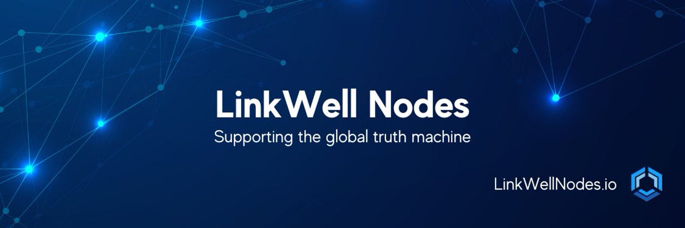

# LinkWell Nodes
A Chainlink community node operations team. Led by truth over trust. Driven to innovate, build and create. Our mission is to enable developers, startups and enterprises to unlock the true value of Web3.

It's hard to believe how far Chainlink has come in the span of just five years. From their first white paper in 2017 in which Chainlink proposed a solution to the oracle problem, a problem once thought unsolvable, but refers to the inherent inability of blockchains to access external data, to their recent announcement on their collaboration with SWIFT and 12+ financial institutions, Chainlink has slowly but surely been fulfilling their destiny of becoming a global standard.

<!--truncate-->

From the start, Chainlink has kept their nose to the grindstone, caring little for media attention or community hype for the first several years, and instead focusing their efforts on researching, developing and building. Last year's SmartCon felt like an inflection point for Chainlink after former Google CEO Eric Schmidt's Fireside chat with Chainlink CEO Sergey Nazarov in which Eric pressured Sergey to just come out and announce Chainlink's true plan - for Chainlink to have a presence in virtually every aspect of Web3.

And after enabling $7 trillion in transaction value, integrating with over 1,700 Web3 projects and the development of CCIP (which is launching soon), it's safe to say that their plan for total world domination (just kidding, kind of) has slowly but surely been coming to fruition.

At LinkWell Nodes, we liken ourselves to Chainlink in a sense. While perhaps not on such a large or epic scale, we too have been keeping our nose to the grindstone, researching, developing and building. And after over a year of hard work and dedication building out our Chainlink node infrastructure, we decided it was time to step out of the shadows and formally announce what we've been working on, and what we have in store.

But before we do, you may be wondering, where did these LinkWell Nodes guys come from? What are they all about, and who are they? Well, hold on to your tendies, as it's time for a short bedtime story.

## Our Story
LinkWell Nodes' story began shortly after the 2022 Chainlink Oracle Olympics - a global competition of 30 professional teams vying for the right to become the next official Chainlink node operator. As individual participants during the competition, we (Ken and Derek - LinkWell Nodes' co-founders) ended up tying for third place - passing every challenge that Chainlink threw at us, but just barely missing out on the bonus points which cinched the victory for the winning team - NorthWest Nodes.

Ken likes to blame his wife for being pregnant and giving birth to his second daughter during the last two days of the competition, but all jokes aside, Ken and Derek decided to join forces, and shortly after, LinkWell Nodes was formed.

As a freshly minted Chainlink node operations team, we immediately went back to the drawing board with an initial vision of designing and engineering the most sophisticated and elegant Chainlink node deployment model that we could possibly devise, with scalability, redundancy, and security at the forefront. With Ken's area of expertise in cybersecurity and Splunk (an enterprise grade monitoring platform), and Derek's area of expertise as a full-stack developer, and our combined expertise with AWS and Chainlink node operations, the path forward was clear.

After over a year of aggressive engineering efforts in the infrastructure, monitoring, and cybersecurity space with our three favorite technologies - AWS, Splunk, and Chainlink, we think that we were able to succeed in fulfilling that vision.

Furthermore, we designed our Chainlink infrastructure stack to be easily deployable and reusable, while keeping members of the Chainlink community desiring to spin up their own nodes as quickly and easily as possible, in mind. As a part of our mission to support the Chainlink community, we may be open sourcing some or all of our stack, but more on that later.

## Our Mission
Led by truth over trust. Driven to innovate, build and create. Our mission is to support Chainlink in enabling developers, startups and enterprises unlock the true value of Web3.

Ultimately, we want to help Chainlink fulfill its mission by doing whatever we can to support the Chainlink community. As community-based Chainlink node operators, we are limited to what services we can provide, but that isn't stopping us from going above and beyond the call of duty.

After spinning up 5 mainnet chains, 6 testnet chains, over 130 direct request jobs and robust documentation to boot, LinkWell Nodes' present objective is to deliver secure, reliable, on-chain data to the general public, all while continuing to innovate on the back-end and supporting the community on the front-end.

LinkWell Nodes has its eyes set on eventually becoming an official node operator, but more importantly, being recognized as one of the most reliable, communicative, and supportive Node Operator teams present in the Chainlink (and broader Web3) ecosystem.

While we recognize that Functions, recently released, is a superior method in many ways to the traditional direct request model, it is still in beta, and currently comes with a few limitations. You can check out our FAQ in order to understand our stance on Functions a bit more in-depth, but at this time, we think there is still a desire and need for traditional direct request support.

That's why we have devoted significant efforts in building out (what we believe) is the most comprehensive set of Chainlink node job offerings and documentation in the public sphere today. Our aim with this effort is to set a new standard for Chainlink community support, and to provide Web3 developers with their off-chain data needs as effortlessly and seamlessly as possible.

## What We Have In Store
Fortunately, we aren't putting all of our eggs in the direct request basket. We've also recognized how challenging it can be for newer Chainlink node operators who don't have as much knowledge or experience as we do with deploying, operating and maintaining Chainlink nodes.

After noticing the same questions arise over and over again in some of the more popular Chainlink Discord channels, we started building out an FAQ that we hope can act as the start of a knowledge base within our public documentation for both aspiring Chainlink node operators and consumers alike. As an aside, we have our own Discord channel as well if you'd like to pop in and join our small but growing community, or if you are a developer in need of support!

## Chainlink Deployment Model In AWS
Additionally, as alluded to earlier, we may have plans in place to open source our Chainlink infrastructure stack for other members of the community to use. We aren't providing any guarantees or timelines on a public release at this time, but if there is enough demand and excitement for this release, we will be happy to move forward with it.
To summarize what that release would look like, however, it would be similar to the AWS Quickstart in that after some basic AWS account setup, a new user would simply fill out an AWS Cloudformation template, hit the deploy button, and be up and running with Chainlink node infrastructure in the time it takes to sip your morning coffee.

One of the major design choices we made with our Chainlink infrastructure deployment model was to make the actual deployment as simple and flexible as possible, with multiple deployment architectures in AWS. Looking to simply spin up a testnet Chainlink node in a public subnet with a 3rd party RPC connection for fast and easy access? We support that.

What about a highly-available and secure architecture with Chainlink nodes, external adapters and full nodes, and with auto-scaling and load balancing built in? We support that as well across all 5 mainnet chains and 6 testnet chains, all via Infrastructure as Code (IAC), with support for more chains to come in the future. What about monitoring and alerting? Out of the box, we include automatic Cloudwatch monitoring and alerting.

## Splunk Integration
But one of the features we are most excited to share is our deep integration with Splunk. While our Splunk integration deserves a separate blog or two on its own (stay posted for that), Splunk is one of the most, if not the most powerful enterprise grade monitoring, alerting and analytics tool on the market today. For the ninth time running, Splunk was named a "Leader" in Gartner's 2022 Magic Quadrant (MQ) for Security Information and Event Management (SIEM).

Tireless efforts were made to not only automatically deploy and configure Splunk within our Cloudformation templates at the flip of a switch, but to also automatically forward all Chainlink infrastructure logs directly into Splunk upon instance boot, if desired to do so.

As we were able to engineer this solution from the ground up, the infrastructure logs and metrics coming from Chainlink nodes, databases, full nodes and external adapters, to name some of the major ones, get fired off to Splunk where they are stored, parsed and configured to populate a robust suite of Chainlink monitoring dashboards and alerts that are wrapped up in our custom built Splunk application.

We didn't just stop at Chainlink infrastructure logs either, as we have monitoring in place at the AWS account level. Cloudtrail API calls, config changes, IAM actions, VPN activity and more are all forwarded and logged in Splunk. And yes, we have dashboards and alerts for this activity too.

As self-proclaimed trendsetters and innovators with the perfect skill sets and background to bring our Chainlink infrastructure and Splunk monitoring capability to life, we don't mention any of this in a boastful manner, but mostly because we are passionate and excited to share what we've developed, and what we have to offer, with the greater Chainlink community.

That being said, it's important to note that due to the exhaustive and at times cumbersome nature of configuring and maintaining Splunk, if there were enough interest and demand, we are considering offering Splunk, along with several other very useful of powerful features that we haven't mentioned yet, as a set of premium but optional capabilities under a subscription based model.

In a perfect world we'd open source everything, but for the time being we aren't quite there yet, so even a small subscription fee would help our ambitious development efforts towards supporting the Chainlink community. But we can cross that bridge when we get there.

Lastly, we recognize that there will likely be an endless need for Chainlink educators and content creators. Whether that be educational content geared towards Chainlink node operations, or content geared towards supporting Web3 developers interested in using Chainlink services, we are here to help.

With what feels like a bull market just around the corner coupled with Chainlink's seemingly unstoppable momentum, there couldn't be a more exciting time to be a part of the Chainlink community, and one can't help but wonder what the next 5 years will have in store!

If you are interested in staying tuned, feel free to join our Discord, or follow us on Twitter @LinkWell_Nodes.

Thanks for reading!