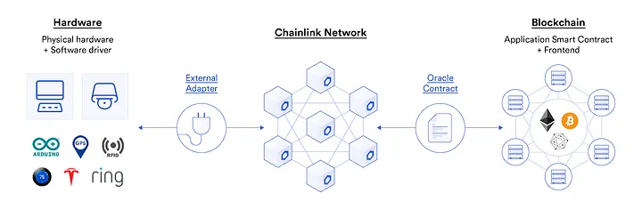
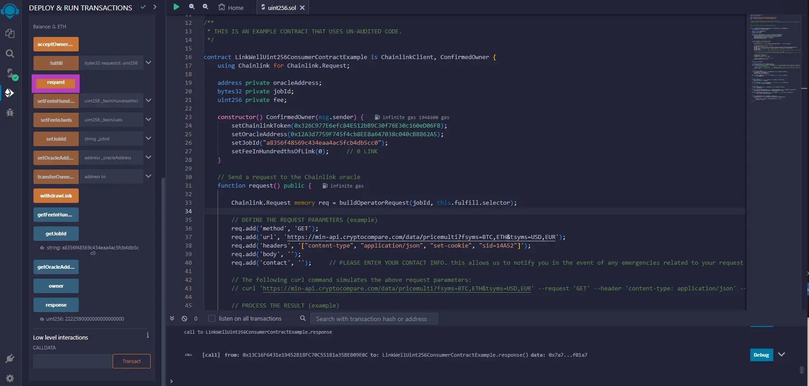
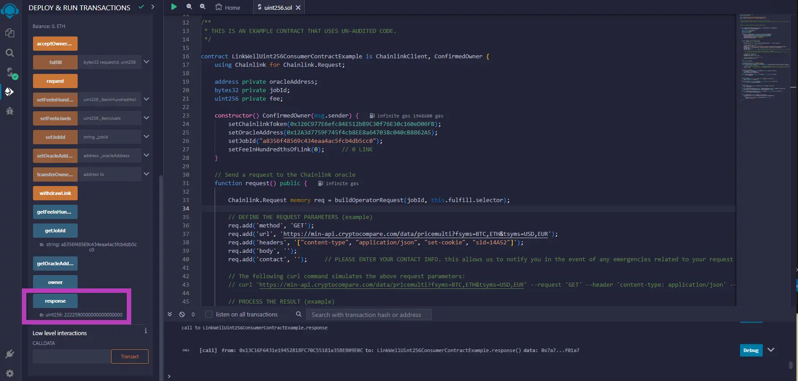

<center><small>*Credit: https://blog.chain.link/apis-smart-contracts-and-how-to-connect-them/*</small></center>

Smart contracts that integrate Chainlink data feeds are far more capable than those that don't.

Since its launch in 2017, Chainlink - the industry standard Web3 services platform - has curated an extensive array of [official data feeds](https://docs.chain.link/data-feeds), among a myriad of other powerful services, providing developers with a seamless integration of real-world information into their applications. However, the dynamic nature of Web3 applications often demands access to data beyond what official Chainlink feeds offer. This is where custom Chainlink [Any API](https://docs.chain.link/any-api/introduction) data feeds step in, catering to the unique requirements of diverse smart contract applications. The process for requesting a custom Any API Chainlink data feed, however, hasn't always been clearly defined.

<!--truncate-->

That's why we've gone through great lengths to make the process as seamless as possible for Web3 developers looking to integrate Chainlink's Any API capabilities.

> ** *Why Chainlink?* **
>
> *Blockchain consensus mechanisms limit smart contracts from directly interacting with the internet, creating the blockchain [oracle problem](https://chain.link/education-hub/oracle-problem). This hurdle represents one of the greatest limitations to representing everyday contracts on the blockchain.*
>
> *Hybrid smart contracts solve this by using oracles as middleware - enabling external data publishing & retrieval, and scalable off-chain computations. Oracles act as a two-way bridge, enhancing connectivity while providing security against single points of failure.*
>
> *Chainlink - the industry standard Web3 services platform - is the most widely used decentralized oracle network, securing significant value across a diverse assortment of blockchains and use cases. It operates as an ecosystem with independent decentralized oracle networks, guaranteeing robust and versatile oracle services.*

**Prerequisites For Making An Any API Request**

There are three Web3 technologies that you'll need to have in place before making your first request:

1. **A Web3 Wallet:** Web3 wallets are required for not only storing your tokens, but also for deploying your smart contracts and signing messages. Examples include Ledger, Trezor, MetaMask, Coinbase Wallet, or Trust Wallet.

1. **An IDE:** EVM-compatible Integrated development environments (IDE) like [Remix](https://remix.ethereum.org/) are required for deploying and testing your smart contract. Advanced users may prefer Hardhat or Foundry, particularly for more complex deployments.

1. **Solidity:** Solidity is Ethereum's primary programming language for developing smart contracts. It will be helpful to have at least a basic understanding of Solidity before getting started.

An additional crucial element that you'll need is a well-defined use case. What project are you working on? What specific on-chain data and APIs are integral to your objectives? And perhaps most importantly, what is your plan for utilizing the data once it's retrieved? The possibilities are endless, and the only true constraint here is the extent of your imagination.

If you don't already have a well-defined use case, here are a few custom data feed ideas:

* **Weather Data:** Retrieve daily and hourly weather forecasts, current conditions, and daily index data from data providers such as OpenWeather or AccuWeather.

* **Sports Data:** Retrieve live scores, player statistics, team information, and historical data from virtually any sports team from data providers include TheRundown or SportsDataIO.

* **DeFi Data:** Real-time and historical cryptocurrency price data, market analysis, and other vital metrics across a multitude of exchanges from data providers such as CryptoCompare.

* **Real-World Asset Data:** Physical and traditional assets such as cash, commodities, equities, bonds, credit, artwork, and intellectual property from professional data providers (e.g. Kelly Blue Book for cars), independent/expert appraisers, exchanges/OTC markets, or any customized aggregation of data sources.

* **IoT Data:** Supply chain tracking, accounting transparency, health wearables, consumption and pollution, parametric insurance that tracks rainfall, GPS sensors, and more.

**Chainlink oracles can return data from anywhere on the internet.** For more ideas, we recommend looking into Chainlink's blog on the [77 different use cases enabled by Chainlink](https://blog.chain.link/smart-contract-use-cases/). Additional custom data feed examples that walk you through building a custom data feed can be found within our [website's documentation](https://docs.linkwellnodes.io/services/direct-request-jobs/Any-API-Guide).
> *If you are interested in the actual mechanics of how requests to Chainlink nodes operate under the hood, feel free to check out our [direct request guide](https://docs.linkwellnodes.io/knowledgebase/Direct-Request-Guide).*

Without further ado, here are the 7 steps for requesting a custom Chainlink data feed.

### **Step 1:** Finding a Suitable Chainlink Node Operator

This is arguably the most crucial step of all. Similar to the way a highly-skilled CPA can enhance tax strategization, potentially leading to substantial annual savings, the importance of proficient Chainlink node operators cannot be overstated.

Working with a knowledgeable and competent Chainlink node operator can greatly streamline the process of requesting and building a custom data feed, allowing you or your team to allocate resources more efficiently to your Web3 application. Furthermore, these node operators should possess the expertise to assist in crafting your smart contract code, conducting code reviews, and suggesting gas optimization strategies within your smart contract. This not only saves time, but can also preserve valuable funds with each data request to the Chainlink oracle.

Here's what you should look for when it comes to a Chainlink node operator:

1. Trustworthy and reliable.

1. A proven track record.

1. Strong communication skills.

1. Transparent and clearly-defined pricing.

1. Reliable, secure, and redundant infrastructure.

1. Knowledgeable in Solidity.

1. A well-defined process for requesting custom data feeds.

1. Continuous monitoring of each data feed request pipeline.

1. A clear service-level agreement (SLA) for their data feed performance.

> *At LinkWell Nodes, we do our best to align with these characteristics and qualities.*
> *Our services include [custom data feed capabilities and self-service oracle solutions](https://docs.linkwellnodes.io/services/direct-request-jobs/Jobs-and-Pricing) across 14 mainnet and 13 testnet blockchains. Beyond that, our suite of [development services](https://docs.linkwellnodes.io/services/Development-Services) is designed to cater to the diverse needs of your Web3 project. We also offer robust documentation on our website in order to help facilitate this process.*

**Where Can I Find a Chainlink Oracle?**

As of the time of writing, there lacks a centralized marketplace for Chainlink oracles. Historically, a Chainlink node marketplace existed at market.link. However, market.link has been deprecated, and the primary avenue for finding an oracle is by sending a chat within the **#operator-requests** channel of the [Chainlink Official Discord server](https://discord.com/invite/chainlink). Additionally, a simple Google search can yield information about the various Chainlink node operators and the services they publicly offer.

Ultimately, the responsibility lies with you to diligently vet and select a Chainlink node operator who aligns with the characteristics specified above.

### **Step 2: Communicating Your Data Requests**

After selecting a Chainlink node operator, you'll want to succinctly convey to them the requirements of your Web3 project. It is beneficial to provide the following information to facilitate effective collaboration:

1. **Blockchain Network:** The blockchain network you plan on deploying your application on.

1. **Data Type:** The type of data you are requesting (i.e., uint256, string[], bool, etc.).

1. **Frequency:** The expected frequency of the request to the oracle (i.e. once a day, once a minute, etc.).

1. **External Adapter:** External adapters exist to perform a variety of custom logic against diverse range of off-chain resources. These resources encompass premium data providers, authenticated web APIs, IoT sensors, bank payments, enterprise back-ends, other blockchain networks, and various other sources.

1. **Urgency:** How soon do you need your new data feed up & running?

1. **Decentralization requirements:** Would you find it acceptable to have one Chainlink node operations team managing your data feed using multiple redundant Chainlink nodes, or do you specifically require the involvement of multiple node operator teams?

1. **Other Chainlink Services:** Do you require additional Chainlink services such as [Automation](https://docs.chain.link/chainlink-automation) or [VRF](https://docs.chain.link/vrf) to be implemented within your smart contract?

1. **API endpoint:** What HTTP URL do you need to request data from? Does it require an API key, a request body, or any headers? Sending a sample CURL command to the node operator should be sufficient here. Example below:

```
    curl https://myApi.com/BTC/USD --request POST --header "X-Auth-Key: my-api-key-123" --data '{"interval": 1, "count": 10}'
```
> *At LinkWell Nodes, to simplify the process of requesting a new data feed, we ask that you fill out our specialized [data feed request form](https://linkwellnodes.io/Getting-Started.html). Once we receive your submission, we'll make every effort to respond promptly and provide your custom data feed ASAP (typically within the day).*

### Step 3: Building and Deploying Your Smart Contract

Although you may have already commenced the development of your smart contract before reaching out to a Chainlink node operator, you may need to modify it to suit your chosen oracle's requirements.
> *At LinkWell Nodes, we provide [comprehensive code samples](https://github.com/LinkWellNodes/Documentation/blob/main/docs/services/direct-request-jobs/mainnets/Arbitrum-One/uint256/uint256.sol#L48-L56) to help you get started on your contract development. These examples serve as a valuable resource in kick-starting your smart contract development, or incorporating our data feeds into your existing smart contract.*

**Key methods within your smart contract include:**

1. **The Constructor:** Here you'll typically specify the [Chainlink (LINK) token contract address](https://docs.chain.link/resources/link-token-contracts) for your respective chain, the oracle address, the job ID, and the per-request payment amount. Oracle addresses, job IDs, and payment amounts are provided by (or negotiated with) your chosen node operator.
```
    constructor() ConfirmedOwner(msg.sender) {
        _setChainlinkToken(0x0Fd9e8d3aF1aaee056EB9e802c3A762a667b1904);
        setOracleAddress(<amoy oracle address>);
        setJobId("a8356f48569c434eaa4ac5fcb4db5cc0");
        setFeeInHundredthsOfLink(0);     // 0 LINK
    }
```

2. **The Request Function:** The request function (also called the transferAndCall() or _sendOperatorRequest() function) defines your request characteristics, and sends the request (and payment) to the Chainlink oracle.

```
    function request() public {
    
        Chainlink.Request memory req = _buildOperatorRequest(jobId, this.fulfill.selector);
        
        // DEFINE THE REQUEST PARAMETERS (example)
        req._add('method', 'GET');
        req._add('url', 'https://min-api.cryptocompare.com/data/pricemulti?fsyms=BTC,ETH&tsyms=USD,EUR');
        req._add('headers', '["content-type", "application/json", "set-cookie", "sid=14A52"]');
        req._add('body', '');
        req._add('contact', '');     // PLEASE ENTER YOUR CONTACT INFO. this allows us to notify you in the event of any emergencies related to your request (ie, bugs, downtime, etc.). example values: 'derek_linkwellnodes.io' (Discord handle) OR 'derek@linkwellnodes.io' OR '+1-617-545-4721'
        
        // The following curl command simulates the above request parameters: 
        // curl 'https://min-api.cryptocompare.com/data/pricemulti?fsyms=BTC,ETH&tsyms=USD,EUR' --request 'GET' --header 'content-type: application/json' --header 'set-cookie: sid=14A52'
        
        // PROCESS THE RESULT (example)
        req._add('path', 'ETH,USD');
        req._addInt('multiplier', 10 ** 18);
    
        // Send the request to the Chainlink oracle        
        _sendOperatorRequest(req, fee);
    }
```  

> *LinkWell Nodes implements a unique and innovative approach that allows for greater control over building your request, but requires a few additional parameters be set (as in the above example).
> **Please refer to our [documentation](https://docs.linkwellnodes.io/services/direct-request-jobs/Jobs-and-Pricing) when building your request - especially in regards to these required request parameters.** *

3. **The Fulfill Function:** Once the data has been retrieved, parsed, and converted into a blockchain-compatible format, our oracle node executes a blockchain transaction against the oracle contract, which in turn writes the data back to your consumer contract via execution of your fulfill() function.

```
    uint256 public response;
    
    // Receive the result from the Chainlink oracle    
    event RequestFulfilled(bytes32 indexed requestId);
    function fulfill(bytes32 requestId, uint256 data) public recordChainlinkFulfillment(requestId) {
     // Process the oracle response
        // emit RequestFulfilled(requestId);    // (optional) emits this event in the on-chain transaction logs, allowing Web3 applications to listen for this transaction
        response = data;     // example value: 1875870000000000000000 (1875.87 before "multiplier" is applied)
    }
```

**Now, deploy it!**

Now that your smart contract's been drafted up, it's time to deploy it. We suggest deploying your smart contract onto a testnet initially, so that you can validate your request logic in a low-risk environment before deploying onto a mainnet. If you need guidance during this process, you can refer to a brief [YouTube tutorial on Remix](https://www.youtube.com/watch?v=vH8T3In6ZkE) by EatTheBlocks. We are happy to assist as well!
> *LinkWell Nodes offers free Chainlink oracle requests on all blockchain testnets, as part of our dedication to supporting the Chainlink community and assisting new Web3 developers.
> We encourage Web3 developers to [take advantage](https://docs.linkwellnodes.io/services/direct-request-jobs/testnets) of this opportunity to submit their requests without any cost.*

<center><iframe width="560" height="315" src="https://www.youtube.com/embed/vH8T3In6ZkE" frameborder="0" allowfullscreen></iframe></center>

### Step 4: Testing the Chainlink Oracle Request In Your Smart Contract

Now comes the fun part - executing the request logic against the oracle specified in your constructor method.

Your first step is to deploy your smart contract code using the [Remix IDE](https://remix.ethereum.org/). After deploying the contract, the next step is to trigger the transferAndCall() function (sometimes called the request() or _sendOperatorRequest() function, highlighted in purple below) within your consumer contract.



Once your data has successfully been retrieved and parsed, our oracle node executes a blockchain transaction against the oracle contract, which in turn writes the data back to your consumer contract via its fulfill() function. Receiving your response may take up to 60 seconds - depending on your chosen blockchain's block time.

Clicking the response button highlighted in purple below should return the data from your request.
> *If your contract hasn't received a response after waiting 2 minutes, you may have an issue with your request, response, or API endpoint. Please check out our [FAQ](https://docs.linkwellnodes.io/knowledgebase/faq/Chainlink-Users#im-not-getting-a-response-back-to-my-consumer-contract) on this subject for more troubleshooting information. We also welcome Web3 developers to join our [Discord channel](https://discord.com/invite/Xs6SjqVPUA), where we are happy to work through any problems that may arise.*



Once the data has been returned, you are free to utilize that data within your smart contract for whatever purpose you need.

### Step 5: Optimizing Your Smart Contract's Request and Fulfill Functions (Optional)

This step is marked as optional, as it is geared towards advanced users and/or use cases.

Reducing the gas costs incurred by the Chainlink node operator in writing your result to your smart contract generally lowers the LINK they'll need to charge you per request. Therefore, it is typically advisable to optimize your fulfill() function's gas usage, in order to increase the overall cost-effectiveness of your Chainlink requests.

> **Side note**: *If your transaction is failing due to an 'out of gas' error, you have several options: A) Provide a smaller response, B) Divide your request into multiple oracle transactions, or C) Reach out to the relevant oracle team to request an increased gas allowance for your specific use case (which may lead to higher job pricing).*

As previously mentioned, optimizing your smart contract's request and fulfill functions is a service we offer as part of our [development services](https://docs.linkwellnodes.io/services/Development-Services).

One other key point - gas prices can be unpredictable, especially when deploying your application on the Ethereum network. In the event of a significant surge in gas prices, the costs incurred by the node operator will spike as well. This forces many node operators to price their data feeds at higher rate to balance out the losses incurred by these market spikes. Consulting with your node operator beforehand on their pricing model may lead to informative conversations here. Whenever possible, we strongly recommend deploying your Web3 application on a layer 2 network such as Arbitrum or Optimism.

### Step 6: Deploying Your Smart Contract On Mainnet and Validating the Request and Fulfill Functions

In this step, we'll discuss the deployment of your smart contract to a mainnet vs a testnet blockchain network.

One notable difference when transitioning from a testnet oracle request to a mainnet oracle request is that your mainnet requests that you send require a nominal fee in the form of the LINK token (usually around 0.1 LINK, depending on the blockchain network and data type). For this reason, it is necessary to fund your smart contract with LINK in order to accommodate the anticipated request volume for your Web3 application.

After deploying and funding your mainnet contract, we suggest executing your request function at least once to ensure your functionality is working as expected.
> *At LinkWell Nodes, we strive for transparency and efficiency around our pricing model. For a more comprehensive understanding of the factors that influence our data feed pricing, you can explore our pricing article [here](https://docs.linkwellnodes.io/services/direct-request-jobs/Pricing).
> **Our commitment is to offer the most competitive pricing in the market.** Deploying your contract initially onto a testnet and making a few requests to our oracles can help us significantly in gauging the lowest-possible pricing for your custom data feed.*

### **Step 7: Go Live With Your Web3 Application**

Congratulations on reaching this point!

Now that your application's data pipeline is fully deployed, you'll need to find some users to interact with your newly-minted and Chainlink-secured Web3 application.

Here are some final recommendations for your Chainlink integration:

1. **Implement Other Chainlink Services:** Your smart contract development journey doesn't need to end with custom data feeds. Chainlink offers a diverse array of supplementary services that can further elevate the potential of your projects. Chainlink Automation, for example, can be an enhancement for automating the request() function to your custom data feed.

1. **Communication:** Practice keeping an open line of communication with your chosen Chainlink node operator to ensure a rapid response in the event of any issues, downtime, or changes you might like them to make.

1. **Monitoring:** Ensure that your selected Chainlink node operator consistently monitors the request pipeline of your custom data feed. To this end, ask them what their alerting policy is for their mainnet data feeds (if any). This vigilance helps to keep your Web3 application safe in the event of any integration issues, such as your API endpoint failing to respond to your oracle's requests.
> *At LinkWell Nodes, it is our mission to provide transparency, security, and ownership over all of your data delivery needs. To that end, we provide a clear [Service-Level Agreement (SLA)](https://docs.linkwellnodes.io/services/direct-request-jobs/Service-Level-Agreement) for all of our mainnet data feeds.*

**Conclusion**

With the proper knowledge and understanding in place, navigating the process of requesting, building, and integrating a Chainlink data feed should not only be seamless - it should be fun and exciting as well! We sincerely hope that this guide serves as a solid foundation for Web3 teams looking to integrate Chainlink's powerful Web3 services and capabilities into their smart contracts.

**Looking for a way to get involved?** Join a team and participate in a hackathon hosted by Chainlink. Hackathons are a great opportunity to enhance your Web3 knowledge, network among like-minded Web3 professionals, meet industry leaders, and even win some cool prizes!

---

> *LinkWell Nodes is a U.S.-based Chainlink oracle.*
>
> *We provide custom data feed capabilities and self-service oracle solutions across all major mainnet and testnet blockchains supported by Chainlink.*
>
> *Looking for a custom data feed? Head on over to our [documentation](https://docs.linkwellnodes.io/services/direct-request-jobs/Jobs-and-Pricing)*, *or hop into our [Discord server](https://discord.com/invite/Xs6SjqVPUA) and ask for help!*


